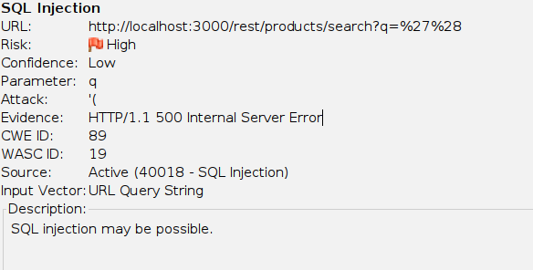
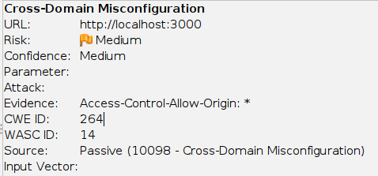

# Descripción del laboratorio:

OWASP Juice shop es un sitio web vulnerable creado para aprender a detectar vulnerabilidades web comunes

OWASP ZAP es una herramienta de ciberseguridad diseñada para detectar vulnerabilidades en sitios web.

Este proyecto consiste en realizar un análisis de vulnerabilidades a la aplicación insegura OWASP Juice Shop utilizando la herramienta de deteccion de vulnerabilidades web OWASP ZAP. 
El objetivo es identificar vulnerabilidades comunes del OWASP Top 10, evaluarlas y proponer recomendaciones de mitigación.

# Entorno y herramientas utilizadas:

OWASP Juice Shop en entorno local

OWASP ZAP (versión 2.16.1)

Kali linux

Durante la evaluación dinámica del entorno OWASP Juice Shop utilizando OWASP ZAP, se identificaron múltiples vulnerabilidades que afectan la seguridad, integridad y privacidad de la aplicación. 
Estas fallas abarcan desde problemas de configuración, exposición innecesaria de información y uso de librerías vulnerables, hasta debilidades que pueden permitir ataques más serios como SQL Injection o Clickjacking.

El objetivo de este reporte es presentar cada hallazgo, su impacto potencial y recomendaciones específicas de mitigación siguiendo buenas prácticas de seguridad, estándares OWASP y configuraciones seguras modernas.

## 📊 Resumen de vulnerabilidades detectadas

| #  | Vulnerabilidad                                 | Severidad |
|----|------------------------------------------------|-----------|
| 1  | SQL Injection                                   | 🔴 Alta   |
| 2  | Content-Security-Policy Header Not Set          | 🔴 Alta   |
| 3  | Cross-Domain Misconfiguration (CORS)            | 🔴 Alta   |
| 4  | Missing Anti-clickjacking Header                | 🟡 Media  |
| 5  | Session ID in URL Rewrite                       | 🔴 Alta   |
| 6  | Vulnerable JavaScript Library                   | 🟡 Media  |
| 7  | Cross-Domain JavaScript Source File Inclusion   | 🟡 Media  |
| 8  | Private IP Disclosure                           | 🟢 Baja   |
| 9  | Server Version Disclosure                       | 🟢 Baja   |
| 10 | Strict-Transport-Security Header Not Set (HSTS) | 🔴 Alta   |
| 11 | Timestamp Disclosure (Unix)                     | 🟢 Baja   |
| 12 | X-Content-Type-Options Header Missing           | 🟡 Media  |

# Vulnerabilidades detalladas

## 1)SQL injection

Severidad: Alta

Descripción: Se detectó que ciertos puntos de entrada permiten la inyeccion de codigo sql, lo podria manipular las consultas ejecutadas por la aplicacion

Impacto: 
- Acceso no autorizado a datos sensibles
- Manipulación o borrado de información
- Posible escalación a comprometer la base de datos completa

Recomendaciones:
- Utilizar consultas preparadas/parametrizadas
- Evitar concatenación de entradas del usuario
- Implementar validaciones estrictas del lado del servidor
- Minimizar privilegios del usuario o base de datos

## 2) Content Security Policy (CSP) Header not set

Severidad: Alta

Descripción: La aplicacion no define una política de seguridad de contenido (CSP), dejando el navegador sin restricciones sobre que fuentes externas puede cargar.

Impacto:
- Amplifica el daño de un ataque Cross Site Scripting (XSS)
- Permite carga de scripts maliciosos externos

Recomendación: 
- Implementar CSP mínimo como:

Content-Security-Policy: default-src 'self';

## 3) Cross-Domain missconfiguration (CORS)

Severidad: Alta

Descripción: La configuracion CORS permite accesos desde origenes no controlados

Impacto:
- Sitios externos pueden realizar peticiones autenticadas
- Riesgo de robo de informacion via CORS

Recomendacion:
- Restringir CORS a dominios especificos
- Evitar [Acces-Control-Allow-Origin:] * Cuando se usan cookies o tokens

## 4) Missing Anti-clickjacking Header

Severidad: Media

Descripcion: La aplicacion no previene ser incrustada en iframes por sitios externos

Impacto: Riesgo de ataques de clickjacking

Recomendacion:
Agregar: "X-FRAME-Options: DENY" o "Content-Security-Policy: frame-ancestors 'none';"

## 5) Session ID in URL Rewrite
Severidad: Alta

Descripcion: La sesion del usuario aparece en la URL, exponiendo el identificador de sesion

Impacto:
- Robo facil de sesion via logs, historial o referer
- Secuestro de sesion

Recomendacion:
- Almacenar sesiones unicamente en cookies seguras
- Usar flags "httponly", "Secure", "SameSite"

## 6) Vulnerabilidad javascript en libreria
Severidad: Media

Descripcion: Se encontraron versiones antiguas o vulnerables de librerias JavaScript [CVE-2020-11023 y CVE-2020-11022]

Impacto:
- Posible ejecucion de codigo malicioso
- Riesgo adicional si se combina con un ataque XSS

Recomendacion: 
- Actualizar librerias a sus ultimas versiones
- Implementar auditoria continua de dependencias

## 7) Cross-Domain JavaScript source file inclusion
Severidad: Media

Descripcion: Se cargan archivos JS desde dominios no controlados.

Impacto: 
- Si un dominio es comprometido, se compromete la aplicacion
- Riesgo de inyeccion de codigo

Recomendacion:
- Servir scripts desde el dominio propio
- Utilizar Subresource Integrity (SRI)

## 8) Private IP Disclosure
Severidad: baja

Descripcion: La aplicacion expone direcciones IP privadas en mensajes o respuestas

Impacto:
- Filtracion de informacion interna
- Facilita reconocimiento para ataques dirigidos

Recomendacion:
- Sanitizar mensajes de error
- Evitar exponer informacion de infraestructura

## 9) Server Version Disclosure (Server Header)

Severidad: Baja

Descripcion: El header Server revela version y tecnologia del servidor

Impacto:
- Un atacante puede identificar vulnerabilidades especificas de esa version

Recomendacion:
- Ocultar informacion del servidor. Ejemplo: (Nginx)

## 10) Strict-Transport-Security Header Not Set (HSTS)

Severidad: Alta

Descripcion: No se esta aplicando HSTS, permitiendo conexiones no cifradas

Impacto:
- Vulnerable a ataques como SSL stripping
- Posibilidad de exponer trafico sensible

Recomendacion:
- Agregar: "Strict-Transport-Security: max-age=31536000"; includeSubDomains; preload

## 11) Timestamp Disclosure - Unix

Severidad: baja

Descripcion: La aplicacion expone timestamps Unix en sus respuestas

Impacto:
- Puede revelar Informacion interna o patrones del sistema
- No suele ser critico pero se reporta por buenas practicas de programacion

Recomendacion:
- Evitar mostrar timestamps inncesarios
- Usar formatos de fecha amigables para el usuario

## 12) X-Content-Type-Options Header Missing
severidad: Media

Descripcion: Falta el header que indica al navegador no interpretar archivos como otro tipo MIME [Man in the Middle]

Impacto:
- Riesgo de ataques MIME-sniffig que pueden derivar en XSS

Recomendacion:
- Agregar: "X-content-Type-options: nosniff"

## CONCLUSION:
El análisis DAST reveló un conjunto significativo de vulnerabilidades relacionadas con configuraciones inseguras, manejo incorrecto de sesiones, exposición de información sensible y falta de controles en el navegador.  
La aplicación OWASP Juice Shop está diseñada para ser vulnerable, por lo que estos hallazgos eran esperables; sin embargo, este ejercicio demuestra capacidad para:

- Identificar vulnerabilidades reales

- Comprender su impacto

- Proponer acciones de mitigación siguiendo mejores prácticas

- Documentar hallazgos de forma profesional
