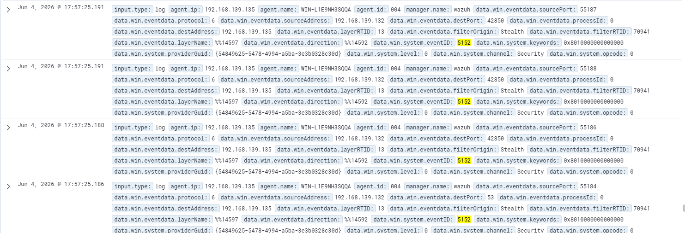

# Enterprise Security Monitoring Lab: Wazuh SIEM + Active Directory

## 📖 Descripción del Proyecto
Este laboratorio práctico simula un entorno corporativo diseñado para centralizar, analizar y detectar eventos de seguridad en tiempo real. La infraestructura integra un entorno de **Active Directory (AD)** basado en Windows Server con el SIEM de código abierto **Wazuh**, permitiendo el desarrollo de capacidades en el triaje de alertas, monitoreo avanzado de endpoints y Threat Hunting.

El objetivo principal de este proyecto es adquirir experiencia real en las tareas diarias de un **Analista de SOC (Security Operations Center)**, cubriendo desde la ingeniería de telemetría hasta la detección de tácticas y técnicas del marco MITRE ATT&CK.

---

## 🏗️ Arquitectura y Componentes del Laboratorio

- | Componente / Rol | Sistema Operativo | Función Técnica |
- | :--- | :--- | :--- | :--- |
- | **Wazuh Manager** | Ubuntu Server 22.04 LTS  | Servidor central. Recolecta, parsea y correlaciona los logs recibidos a través de reglas de seguridad. |
- | **Domain Controller** | Windows Server 2025  | Controlador de Dominio (KDC Kerberos / Active Directory). Gestión de identidades. |
- | **Endpoint Víctima** | Windows 11 Enterprise | Estación de trabajo unida al dominio bajo monitoreo continuo del agente de Wazuh. |

---

## 🛠️ Ingeniería de Telemetría (Hardening de Auditoría)
Para evitar "puntos ciegos" en la red, se configuraron políticas avanzadas de auditoría en los sistemas operativos Windows, garantizando visibilidad completa sobre eventos críticos:

* **Monitoreo de Identidad (Kerberos & NTLM):** Activación de directivas avanzadas en `secpol.msc` para capturar eventos de validación de credenciales (**Event ID 4776**), inicios de sesión exitosos (**Event ID 4624**) y fallidos (**Event ID 4625**).
* **Visibilidad de Procesos Avanzada:** Activación del seguimiento detallado de procesos (**Event ID 4688**) y configuración del registro para incluir la **Línea de Comandos Completa (`commandLine`)**, permitiendo auditar los argumentos exactos ejecutados en consolas (CMD/PowerShell).

---

## ⚔️ Casos de Uso y Simulaciones de Ataque (MITRE ATT&CK)

Caso de Estudio: [Escaneo de puertos no autorizado]

Resumen 

Se detectó y registró una actividad de reconocimiento táctico inicial (escaneo activo de puertos) dirigida contra el Controlador de Dominio de la infraestructura (WIN-L1E9NH3SQQA). El ataque fue ejecutado de forma automatizada mediante ráfagas de conexiones TCP en un intervalo de tiempo extremadamente reducido (milisegundos), con el fin de identificar servicios expuestos y mapear la superficie de ataque interna.

Objetivos
- Generar actividad sospechosa controlada.
- Analizar la telemetría recolectada por Wazuh.
- Identificar eventos relevantes.
- Documentar el proceso de investigación.

Responder:
### Evidencia:

La evidencia forense contundente se encuentra centralizada en el SIEM Wazuh mediante la indexación masiva del Event ID 5152 (Filtering Platform Packet Drop) correlacionado con la dirección IP de origen del atacante. El Visor de Eventos local de Windows Server respaldó la anomalía antes de su ingesta en el SIEM.

MITRE ATT&CK

- TTP: T1595	Active Scanning

### ¿Qué ocurrió?

Se detectó un intento de reconocimiento de red (Network Scanning) dirigido hacia el Controlador de Dominio de la infraestructura. Un host no autorizado en el segmento de red (192.168.139.132) realizó un barrido de puertos TCP para identificar servicios expuestos y posibles vectores de entrada.

### Evidencia que lo demuestra

La evidencia principal es la ráfaga de eventos Event ID 5152 generados por la Plataforma de Filtrado de Windows (WFP). Los registros muestran múltiples intentos de conexión hacia puertos sensibles (como el 53 - DNS) y puertos aleatorios en un intervalo de tiempo de milisegundos, todos originados desde la misma dirección IP externa.

### Informacion proporcionada por los logs
Los logs de Wazuh (alimentados por el canal de Seguridad de Windows) proporcionan:

Origen del Ataque: IP 192.168.139.132 (Kali Linux).

Víctima: Host WIN-L1E9NH3SQQA (Windows Server).

Vector Técnico: Uso de paquetes de tipo Stealth (probablemente un escaneo SYN de Nmap).

Acción del Firewall: Bloqueo y descarte automático de paquetes (Packet Drop).

## Información obtenida por el atacante

Debido a que el Firewall de Windows estaba en modo "Drop" (Descarte), el atacante recibió respuestas de tipo Filtered. Esto significa que el atacante probablemente no pudo confirmar qué servicios estaban abiertos, pero sí confirmó que el host estaba encendido y protegido por un firewall activo.

### Lecciones Aprendidas

Durante la investigación se descubrió que el Event ID 5152 estaba filtrado por la configuración del agente Wazuh (con el objetivo de disminuir el volumen de logs), lo que impedía su visualización en el SIEM. Fue necesario revisar el archivo ossec.conf para analizar el comportamiento observado.

Conclusión

Resumen final de lo aprendido y de la efectividad de la detección.
