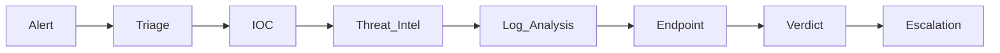

# SOC Analyst Portfolio
### Documented Security Incident Investigations

This portfolio currently contains **12 documented SOC investigations** covering multiple attack vectors including phishing, malware, web exploitation, authentication attacks, LOLBins, and zero-day vulnerabilities.

Each case follows a structured incident response methodology, including:

- Initial Alert Triage
- IOC Identification
- Threat Intelligence Validation
- Log Correlation
- Endpoint Investigation
- Root Cause Analysis
- MITRE ATT&CK Mapping
- Incident Classification
- Escalation Notes
- Lessons Learned

## Incident Categories

- Web Attacks
- Malware
- Phishing
- Ransomware
- LOLBins
- Unauthorized Access
- Privilege Escalation
- Brute Force
- Threat Intelligence
- Email Security
- SQL Injection
- Zero-Day Exploitation

## Investigation flow

## Skills Demonstrated

- SIEM Investigation
- Threat Intelligence
- IOC Analysis
- Log Analysis
- Endpoint Investigation
- Email Security
- Malware Analysis
- Web Attack Investigation
- Authentication Analysis
- Incident Triage
- Incident Escalation
- MITRE ATT&CK Mapping
- Phishing Analysis
- Threat Classification

## Featured Case Studies

| Case | Severity | Key Skills | Investigation |
|------|----------|------------|---------------|
| ⭐ SharePoint ToolShell Auth Bypass & RCE | Critical | PowerShell, Zero-Day Investigation, CVE Analysis |📂 [--> View](./Use_case_011_SharePoint_ToolShell_Auth_Bypass_RCE/README.md) |
| ⭐ Windows OLE Zero Click RCE | Critical | Email Security, LOLBins, Threat Intel | 📂 [--> View](./Use_case_012_Windows_OLE_Zero_Click_RCE/README.md) |
| ⭐ ClickFix Phishing | High | Phishing, Endpoint Investigation | 📂 [--> View](./Use_case_006_Click_Fix_Phishing/README.md)|
| ⭐ SQL Injection | High | SQL Injection Analysis, Web Logs | 📂 [--> View](./Use_case_009_SQL_Injection_detected/README.md)|
| ⭐ LOLBin mshta.exe | High | LOLBins, PowerShell, Process Analysis | 📂 [--> View](./Use_case_008_LOLBin_mshta.exe/README.md)|
| ⭐ Unauthorized Access | Low | MFA, VPN, Threat Intel | 📂 [--> View](./Use_case_010_Unauthorized_access_attempt/README.md)|

## Additional SOC Investigations

| Case | Category | Severity | Skills Demonstrated |
|------|----------|----------|---------------------|
| Brute Force Attempt | Brute Force | High | Authentication Analysis, Windows Event Logs, Account Enumeration, Incident Classification |
| RCE Detected in Splunk Enterprise | Unauthorized Access / RCE | High | Endpoint Analysis, Reverse Shell Investigation, Threat Hunting, Incident Escalation |
| Ransomware Detected | Malware | Critical | Malware Analysis, Endpoint Investigation, IOC Identification, Incident Response |
| Privilege Escalation | Privilege Escalation | Medium | Process Analysis, Privilege Abuse Detection, Windows Security Monitoring |
| WMI Suspicious Activity | WMI / Lateral Movement | Medium | WMI Analysis, Living-off-the-Land Techniques, Process Investigation |
| Impersonating Domain MX Record Change | Threat Intelligence | Medium | Threat Intelligence, DNS Analysis, Phishing Infrastructure Investigation |
