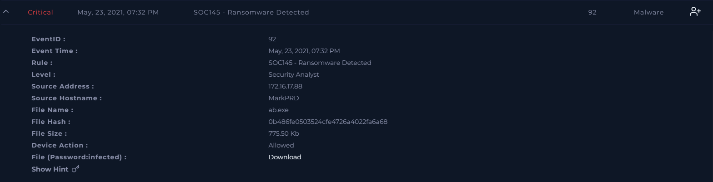
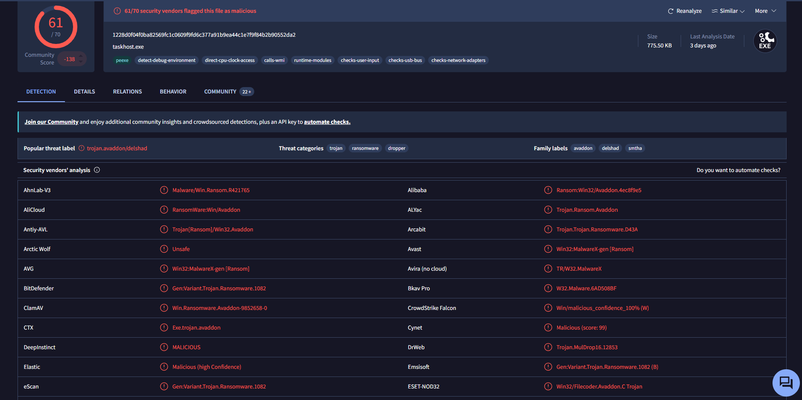
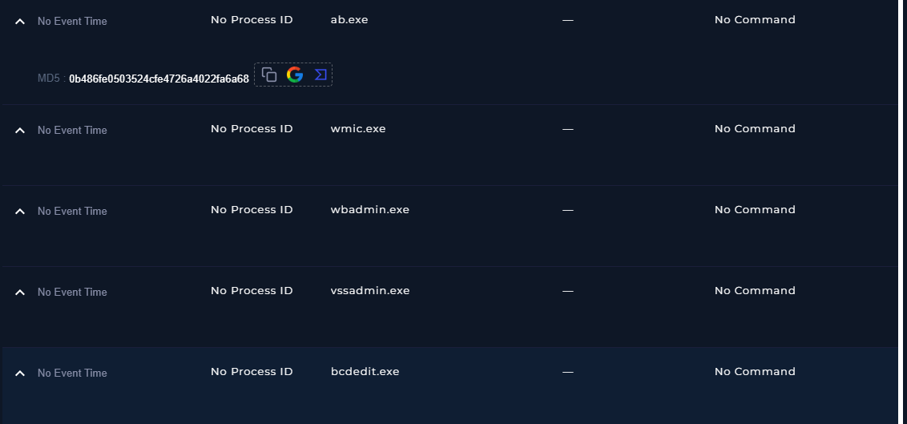
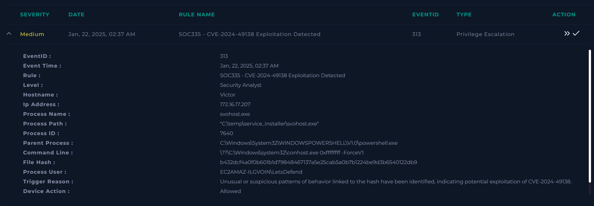
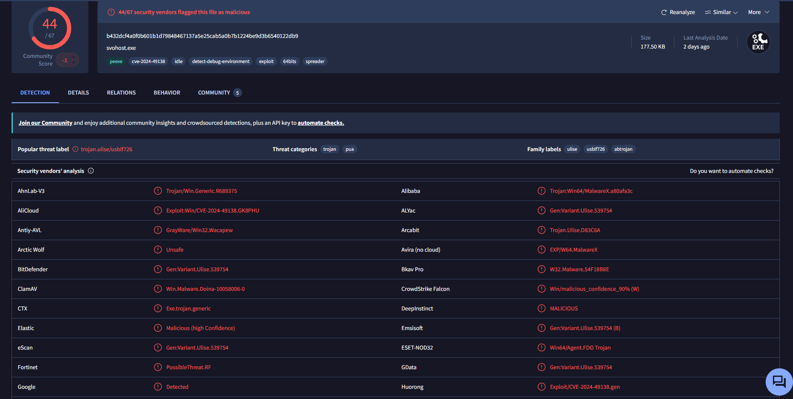
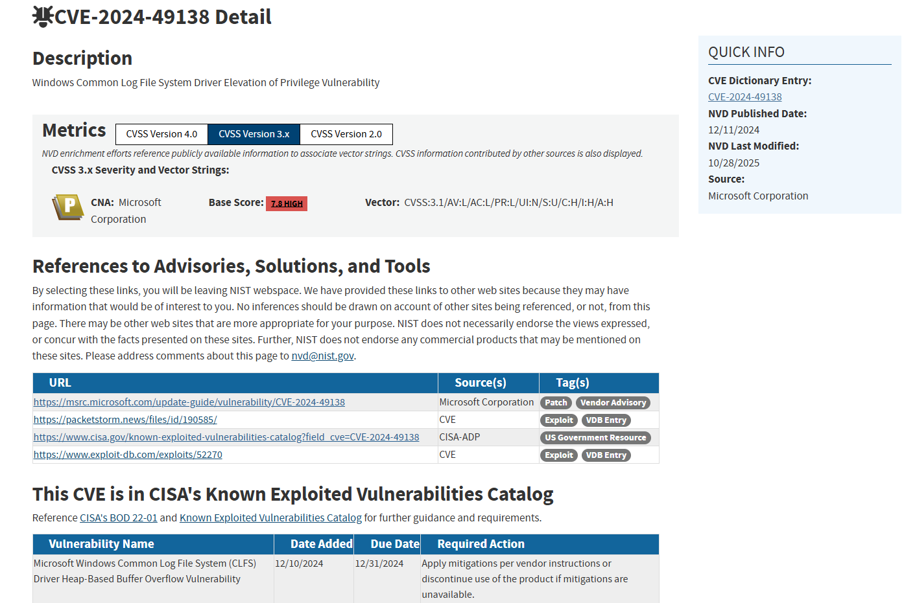

# This is my documented experience in a SOC enviroment with the blue team practice platform "LetsDefend"

The goal of this Lab/Practice is to show my experience dealing with several common types of real simulated SOC incidents like:
- Brute Force attacks attempts
- Ransomware
- Unauthorized Access
- Privilage Scalation
- Phishing attempts
- etc

## Use case-001: Brute force attepmt (Hight severity alert)

### Incident Summary

A high-severity alert (SOC210 - Possible Brute Force Detected on VPN) was generated after multiple failed VPN authentication attempts were observed from a single source IP address, followed by a successful login. The alert indicated potential brute-force or password-spraying activity targeting VPN access.

### Evidence Analyzed
Alert Information
Alert Name: SOC210 - Possible Brute Force Detected on VPN
Severity: High
Source IP: 37.19.221.229
Destination: VPN Gateway (vpn-letsdefend.io)
Successful User Authentication: mane@letsdefend.io
Authentication Logs

## Investigation of VPN authentication logs revealed:

- Multiple authentication attempts originating from the same source IP address.
- Attempts were made by trying multiple usernames (user enumeration) until one of them match as a valid username
- Initial failures returned the message: "Username does not exist"
- Later attempts returned: "Username is correct but password is wrong"
- Then account mane@letsdefend.io experienced highest number of login attempts.
- A successful authentication occurred approximately six minutes after the initial failed attempts.
- Threat Intelligence Investigation:
  - Source IP 37.19.221.229 was investigated using available threat intelligence resources.
  - No known malicious reputation was identified.
 
### MITRE-ATT&CK:

  - T1110 - Brute Force
  - T1110.003 - Password Sprying

### Endpoint Investigation

Endpoint activity associated with the user account was reviewed.

#### Findings:

- Previous legitimate activity was observed before the successful VPN login.
- No suspicious process execution or post-authentication activity was identified after the successful VPN login.
- No evidence of malware execution, privilege escalation, or lateral movement was observed.
- IOC Found:
  - Source IP Address: 37.19.221.229

- Targeted User Account: mane@letsdefend.io
- Timeline:
- 01:43 PM	Multiple VPN login attempts begin from source IP 37.19.221.229
- 01:45 PM - 01:43 PM	Authentication failures observed against trying multiple user accounts
- 01:47 - 01:50PM	Attempts transition from invalid usernames to valid username with incorrect passwords
- 01:51 PM	Successful VPN authentication for mane@letsdefend.io
- Post 01:51 PM	No suspicious activity observed on the endpoint
- Classification: True Positive

The investigation identified behavior consistent with password spraying or brute-force activity.

### Supporting evidence:

- Trying different usernames and targeted from a single IP address.
- Username "mane@letsdefend.io" was correct.
- Repeated password failures against mane@letsdefend.io
- Successful authentication after multiple password failed attempts.

Although no malicious post-authentication activity was identified, the authentication pattern matched the detection logic of the brute-force alert and represented a legitimate security concern.

### Recommendation
- Reset loggin credentials of the affected account.
- Review recent activity associated with the account.
- Enable Multi-Factor Authentication (MFA) if not already implemented.
-Monitor for additional authentication attempts from the source IP address.
- Review VPN access logs for similar activity targeting other users.

### Escalated for further review.

Reason:
A successful VPN authentication occurred after multiple failed login attempts against account "mane@letsdefend.io". Additional review by a senior analyst is recommended to determine whether account compromise occurred and whether containment actions are necessary.

## Use case-002 RCE Detected in splunk enterprise (Hight severity alert)

SOC239 - Remote Code Execution Detected in Splunk Enterprise

### Incident Summary

A high-severity alert was triggered after the detection of a malicious XSLT file upload targeting a Splunk Enterprise server. Initial investigation revealed successful authentication to the Splunk web interface using the administrative account, followed by the upload of a malicious XSL file designed to create a reverse shell script on the target system.

Subsequent endpoint telemetry confirmed command execution on the host and the creation of a new local user account, indicating successful compromise and persistence establishment.

### Evidence Analyzed
- Alert Information
  - Alert Name: SOC239 - Remote Code Execution Detected in Splunk Enterprise
- Severity: High
- Event Type: Unauthorized Access
- Source IP: 180.101.88.240
- Destination IP: 172.16.20.13
- HTTP Method: POST
- Affected System: Splunk Enterprise Server
- Authentication Activity

A successful authentication attempt was observed shortly before the malicious upload activity:

- Username: admin
- Request: POST /account/login
- Response Code: 200 OK
- Malicious Files

The uploaded archive contained:

- shell.xsl
- shell.sh

The XSLT file was configured to create the shell.sh script inside:

/opt/splunk/bin/scripts/

The generated script was intended to establish a reverse shell connection to the attacker's host.

Endpoint Activity

The following commands were executed on the compromised server:

- id
- whoami
- ls
- cat

Observed processes:

Parent Process: sshd
Shell: bash

Additional persistence-related activity was identified:

- useradd -m analyst
- passwd analyst

These commands created a new local user account and assigned credentials.

### IOC Found
- Network Indicators
- Type	Value
- Source IP	180.101.88.240
- Reverse Shell Destination	180.101.88.240:1923
- Login Endpoint	/account/login
- File Indicators
- Type	Value
- XSL File	shell.xsl
- Shell Script	shell.sh
- User Indicators
- Administrative Account	admin
- Created Account	analyst
- Timeline: 12:23:56 PM

Successful authentication attempt observed:

- POST /account/login
- Username: admin
- password: SPLUNK-i-04673a41b8017af54
- Response: 200
- 12:24 PM

Malicious XSLT file uploaded to Splunk Enterprise.

- 12:24:28 PM

- Command execution detected:

id
12:24:33 PM

- Command execution detected:

whoami
12:24:44 PM

Local account creation detected:

12:24:48 PM: useradd -m analyst

Password assignment detected:

- 12:24:55 PM: passwd analyst

Directory enumeration activity detected:

- ls

### MITRE ATT&CK Mapping

#### Initial Access

  - T1190 - Exploit Public-Facing Application

    - The attacker abused a vulnerable Splunk feature by uploading a malicious XSLT file designed to achieve code execution.

- Execution

- T1059.004 - Command and Scripting Interpreter: Unix Shell

- Commands were executed through a Linux shell environment:

- id
- whoami
- ls
- Discovery

#### T1033 - System Owner/User Discovery

The attacker executed:

- whoami: to determine the current user context.

#### Discovery

- T1087 - Account Discovery

The attacker executed:

- id: to enumerate account and privilege information.

#### Persistence

- T1136.001 - Create Account: Local Account

- A new local user account was created: useradd -m analyst

followed by: passwd analyst to establish persistence.

#### Command and Control

T1071 - Application Layer Protocol

The reverse shell payload attempted to establish outbound communications over TCP.

### Classification:

- True Positive: Evidence confirms successful compromise of the Splunk Enterprise server through authenticated exploitation, command execution, and persistence establishment.

### Recommendation

- Immediately isolate the affected Splunk server.
- Disable and investigate the newly created user account.
- Reset credentials associated with the administrative account.
- Review Splunk configuration and patch vulnerable components.
- Search for additional indicators of compromise across the environment.
- Review outbound network connections to identify potential command-and-control communications.
- Conduct forensic analysis to determine the full scope of attacker activity.
- Escalation Decision

### Escalated to Incident Response Team

The incident was escalated due to confirmed command execution and persistence establishment on a production server. Additional forensic investigation is required to determine the extent of compromise, identify potential lateral movement, and perform containment and eradication activities.

## Use case-003: Ranwomware Detected (Critical severity alert)

SOC145 - Ransomware Detected

### Incident Summary

A critical security alert was triggered after the execution of a suspicious executable file identified as ab.exe on the host MarkPRD (172.16.17.88).

Initial investigation focused on validating the file hash and determining whether the alert represented a legitimate ransomware incident. Threat intelligence analysis revealed that the file hash was identified by 61 out of 70 security vendors as malicious and associated with ransomware activity, specifically the Avaddon ransomware family.

Additional endpoint activity showed the execution of several Windows utilities commonly abused by ransomware operators to disable recovery mechanisms and hinder incident response efforts.

Based on the collected evidence, the alert was classified as a True Positive and escalated for further investigation.

### Step 1 – Threat Intelligence Validation

The file hash associated with the alert was analyzed using VirusTotal.

**Findings**
- 61/70 security vendors detected the file as malicious.
- Multiple engines classified the sample as ransomware.
- Malware family references included:
- Avaddon
- DelShad

**Conclusion**

- The hash reputation provided strong evidence that the executable represented a legitimate malware threat rather than a false positive.

### Step 2 – Endpoint Investigation

Endpoint telemetry was reviewed to identify suspicious activity following the execution of ab.exe.

The following processes were observed after the ransomware execution:

- wmic.exe
- vssadmin.exe
- wbadmin.exe
- bcdedit.exe

These utilities are frequently leveraged by ransomware operators to:

- Delete shadow copies.
- Disable recovery mechanisms.
- Interfere with backup restoration.
- Prepare the environment for file encryption.

### Step 3 – Additional Validation

All legitimate-looking processes observed prior to the alert were validated using VirusTotal and determined to be benign system or user applications, including:

- AcroRd32.exe
- Outlook.exe
- Chrome.exe
- svchost.exe
- explorer.exe
- winlogon.exe

No malicious indicators were identified among those processes.

Indicators of Compromise (IOC)
- File Indicators
- Type |	Value
- Filename	ab.exe
- MD5	0b486fe0503524cfe4726a4022fa6a68
- Host Indicators
- Type |	Value
- Hostname	MarkPRD
- IP Address	172.16.17.88
- Behavioral Indicators
- Process
- wmic.exe
- vssadmin.exe
- wbadmin.exe
- bcdedit.exe

### MITRE ATT&CK Mapping

- Execution

T1204 - User Execution

The ransomware payload was executed on the endpoint.

- Execution

T1059 - Command and Scripting Interpreter

The malware triggered the execution of multiple Windows administrative utilities.

- Impact

T1486 - Data Encrypted for Impact

The malware was identified as ransomware and, according to the scenario documentation, encrypted files on the affected system.

- Defense Evasion

T1490 - Inhibit System Recovery

Observed execution of:

- vssadmin.exe
- wbadmin.exe
- bcdedit.exe

indicates attempts to interfere with recovery and backup mechanisms.

- Discovery

T1047 - Windows Management Instrumentation (WMI)

Execution of:

- wmic.exe

suggests system interaction through WMI functionality.

**Assessment**
Alert Classification: True Positive

Confidence Level: High

**Reasoning**

- File hash detected as malicious by 61/70 security vendors.
- Malware associated with known ransomware family (Avaddon).
- Endpoint activity consistent with ransomware behavior.
- Execution of utilities commonly used to disable recovery capabilities.
- Scenario documentation confirmed successful file encryption.

**Limitations**

Endpoint visibility was limited because detailed telemetry such as:

- Command-line arguments
- Terminal history
- Network activity
- Browser activity

was not available during the investigation.

As a result, the complete attack chain could not be reconstructed from the available evidence.

### Escalation Decision

Escalated to Incident Response Team

The incident was escalated due to confirmed ransomware execution on the endpoint and evidence of actions consistent with recovery inhibition techniques.

Further forensic investigation was recommended to:

- Determine the scope of encrypted data.
- Identify potential lateral movement.
- Assess business impact.
- Support containment and eradication activities.

### Lessons Learned

This investigation highlighted the importance of validating malware alerts through threat intelligence sources and recognizing behavioral indicators associated with ransomware activity.

The case also demonstrated that SOC Analysts often need to make escalation decisions using incomplete telemetry while relying on available evidence to determine risk and severity.

## Use case-004: Privilege Escalation (Medium severity alert)

SOC335 – CVE-2024-49138 Exploitation Detected

### Incident Summary

A medium-severity alert was generated after the execution of a suspicious executable named svohost.exe on host Victor (172.16.17.207). Initial threat intelligence analysis identified the file as malicious, with 44 security vendors detecting it as Trojan.Ulise.

Further investigation revealed that the executable was downloaded through PowerShell, executed from a temporary directory, and subsequently spawned a new PowerShell process running under NT AUTHORITY\SYSTEM, indicating successful privilege escalation.

The observed activity was consistent with exploitation behavior associated with CVE-2024-49138, leading to the classification of the alert as a True Positive.

**Alert Information**

**Investigation Methodology**

The investigation focused on answering three key questions:

- Is the detected file malicious?
- Was CVE-2024-49138 actually exploited?
- Did privilege escalation occur successfully?

### Phase 1 – Threat Intelligence Analysis

The file hash was analyzed using VirusTotal.

**Findings**

- SHA256
- b432dcf4a0f0b601b1d79848467137a5e25cab5a0b7b1224be9d3b6540122db9
- Results:
  - 44/67 security vendors flagged the file as malicious.
  - Multiple detections identified the sample as Trojan.Ulise.
  - Alert description associated the sample with exploitation activity related to CVE-2024-49138.
 

Assessment: The reputation analysis strongly indicated that the file represented a legitimate security threat rather than a false positive.

### Phase 2 – Process Timeline Reconstruction

User Reconnaissance Activity

Prior to executing the malware, the user launched PowerShell and executed the following commands:

- whoami /priv
- whoami

**Analysis**

These commands are commonly used to:

- Identify the current user context.
- numerate available privileges.
- Verify whether privilege escalation has succeeded.

**MITRE ATT&CK**

T1033 – System Owner/User Discovery

Malware Download

Shortly afterward, PowerShell downloaded an archive from:

https://files-ld.s3.us-east-2.amazonaws.com/service-installer.zip

The archive was extracted to:

C:\temp\service_installer\

**Analysis**

This activity indicates the delivery stage of the attack, where a payload is transferred to the victim host before execution.

**MITRE ATT&CK**

T1105 – Ingress Tool Transfer

Malware Execution

The downloaded executable was launched:

C:\temp\service_installer\svohost.exe

**Observations**

The filename closely resembles the legitimate Windows process: svchost.exe

However, several indicators suggested malicious intent:

- Indicator	Observation
- Name	svohost.exe
- Legitimate Process	svchost.exe
- Execution Directory	C:\temp
- Expected Directory	C:\Windows\System32

Analysis

The attacker appears to have intentionally chosen a filename visually similar to a legitimate Windows process in an attempt to evade casual inspection.

**MITRE ATT&CK**

T1036 – Masquerading

### Phase 3 – Privilege Escalation Verification

The most significant finding occurred after execution of the malicious binary.

Initial Context

The malware was executed by:

EC2AMAZ-ILGVOIN\Victor

Process chain:

Victor
└── powershell.exe
    └── svohost.exe
Escalated Context

Approximately 42 seconds later, a new PowerShell process appeared.

Process details:

Process User:
NT AUTHORITY\SYSTEM

Parent Process:
svohost.exe

Process chain:

Victor
└── powershell.exe
    └── svohost.exe
        └── powershell.exe (SYSTEM)

Analysis

- This represents a privilege transition from a standard user context to the highest local privilege level available on Windows.

- The parent-child relationship directly links the malicious executable to the creation of the SYSTEM-level PowerShell process.

- This evidence strongly suggests successful exploitation resulting in privilege escalation.

**MITRE ATT&CK**

- T1068 – Exploitation for Privilege Escalation

Evidence Supporting True Positive Classification

The alert was classified as a True Positive based on the following evidence:

**Malware Indicators**

- Malicious SHA256 hash.
- 44 VirusTotal detections.
- Trojan.Ulise classification.

**Behavioral Indicators**

- PowerShell download activity.
- Execution from a temporary directory.
- Masquerading through a deceptive filename.

**Privilege Escalation Indicators**

- User context changed from Victor to NT AUTHORITY\SYSTEM.
- SYSTEM PowerShell process spawned directly from the malicious executable.
- Behavior consistent with exploitation of CVE-2024-49138.

**Indicators of Compromise (IOC)**

**Host:**

- Hostname: Victor
- IP Address: 172.16.17.207

**File**

- Filename: svohost.exe
- Path: C:\temp\service_installer\svohost.exe
- SHA256: b432dcf4a0f0b601b1d79848467137a5e25cab5a0b7b1224be9d3b6540122db9

- Download Source: https://files-ld.s3.us-east-2.amazonaws.com/service-installer.zip

**MITRE ATT&CK Mapping**

- Technique ID | Technique
T1033	System Owner | User Discovery
T1059.001	| PowerShell
T1105	| Ingress Tool Transfer
T1036	| Masquerading
T1068	| Exploitation for Privilege Escalation

**Timeline**

Time |	Event
14:36:26	| User executes whoami /priv
14:36:39	| User executes whoami
14:37:10	| PowerShell downloads service-installer.zip
14:37:12	| svohost.exe executed
14:37:12	| Malicious hash detected
14:37:54	| SYSTEM PowerShell process spawned by svohost.exe
14:38+	| Microsoft Defender activity observed

### Lessons Learned

This investigation demonstrated the importance of validating alerts through behavioral evidence rather than relying solely on threat intelligence.

Although the malicious hash provided an initial indication of compromise, the decisive evidence came from process telemetry showing a direct transition from a standard user context to NT AUTHORITY\SYSTEM.

The case also highlighted several common attacker techniques, including PowerShell-based payload delivery, process masquerading, and exploitation for privilege escalation.

### Analyst Conclusion

The investigation confirmed that a malicious executable associated with Trojan.Ulise was downloaded and executed on the endpoint. Analysis of process activity demonstrated a successful transition from a standard user context to NT AUTHORITY\SYSTEM, providing strong evidence of privilege escalation.

The alert was classified as a True Positive and escalated for incident response and containment activities.
