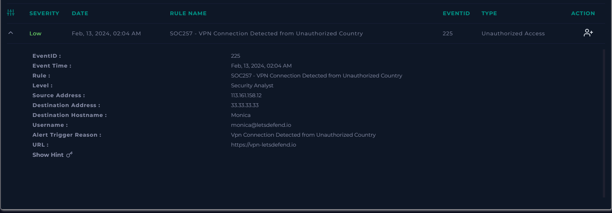
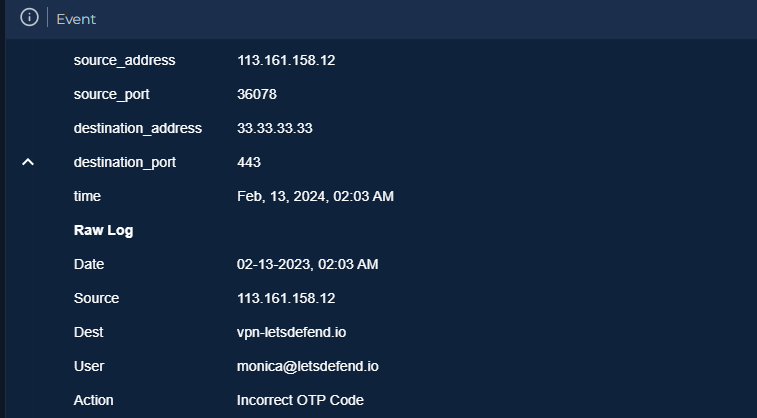

# Unauthorized VPN Authentication Attempts from Unauthorized Country (SOC257)

## Scenario Overview

A low-severity alert was triggered after a VPN connection attempt was detected from an unauthorized country targeting a corporate VPN account. The investigation focused on determining whether the alert represented legitimate user activity, a benign false positive, or an attempted unauthorized access event.

Analysis of VPN, authentication, email security, and threat intelligence data showed that the account monica@letsdefend.io was targeted by repeated VPN authentication attempts from 113.161.158.12, an IP associated with Hanoi, Vietnam. The activity triggered multiple MFA OTP emails to the user and generated Incorrect OTP Code authentication logs, indicating repeated failed MFA attempts.

No evidence of a successful VPN login was identified. However, the repeated OTP generation, failed OTP submissions, unauthorized geolocation, and threat intelligence context strongly support classifying the alert as a True Positive attempted unauthorized access incident.

Important note: Although some suspicious endpoint command history was observed on the same day, it was excluded from the final incident assessment due to time inconsistencies and the absence of evidence showing a successful MFA bypass or VPN login. Therefore, this case was documented strictly as a VPN authentication / unauthorized access investigation, not as a confirmed endpoint compromise.

| Field                | Value                                                                                                 |
| -------------------- | ----------------------------------------------------------------------------------------------------- |
| Alert Name           | SOC257 - VPN Connection Detected from Unauthorized Country                                            |
| Severity             | Low                                                                                                   |
| Category             | Unauthorized Access                                                                                   |
| Event ID             | 225                                                                                                   |
| Detection Time       | Feb 13, 2024, 02:04 AM                                                                                |
| Source IP            | 113.161.158.12                                                                                        |
| Destination IP       | 33.33.33.33                                                                                           |
| Destination Host     | Monica                                                                                                |
| Username             | [monica@letsdefend.io](mailto:monica@letsdefend.io)                                                   |
| VPN Portal           | `https://vpn-letsdefend.io`                                                                           |
| Final Classification | True Positive                                                                                         |
| Incident Summary     | Attempted unauthorized VPN authentication with repeated MFA OTP generation and failed OTP submissions |

## Investigation Process

### 1) Initial Alert Review

The alert indicated that a VPN connection attempt was detected from an unauthorized country against the account: monica@letsdefend.io

Initial alert fields showed:

- Source IP: 113.161.158.12
- Destination: vpn-letsdefend.io
- Detection time: Feb 13, 2024, 02:04 AM

**At this stage, the main investigation questions were:**

- Was this a legitimate login attempt by Monica while traveling?
- Was this an automated or malicious attempt to access the VPN?
- Was MFA successfully bypassed?
- Did the attacker gain access to the account or the VPN?

### 2) VPN / Authentication Log Analysis

Log Management showed multiple connection attempts from the same source IP to the VPN infrastructure in a short time window.

Observed events included repeated traffic from: 113.161.158.12 → 33.33.33.33 (vpn-letsdefend.io)

between approximately:

- 01:50 AM
- 01:54 AM
- 01:56 AM
- 01:57 AM
- 01:58 AM
- 02:03 AM

- This pattern strongly suggested repeated authentication attempts, not a one-time legitimate access.

### 3) Failed OTP / MFA Validation

A critical authentication log showed:

- Action: Incorrect OTP Code
- User: monica@letsdefend.io
- Source IP: 113.161.158.12
- Destination: vpn-letsdefend.io
- Time: Feb 13, 2024, 02:03 AM

This was an important finding because it confirmed that the actor reached the MFA stage of the VPN authentication flow but failed to provide the correct OTP.

This means the event was not merely passive VPN traffic or page browsing — it was an active authentication attempt against a real user account.

### 4) Email Security Evidence – MFA OTP Emails

Email security logs provided strong supporting evidence. Three separate MFA OTP emails were sent to monica@letsdefend.io within minutes of the VPN activity.

**mail_image**

One of the OTP emails included the following metadata:

- IP: 113.161.158.12
- URL: https://vpn-letsdefend.io
- OS: Windows
- Browser: Chrome
- Location: Hanoi, Ha Noi

This is a major piece of evidence because it confirms:

- the VPN login flow reached MFA challenge generation
- the target account was Monica’s
- the activity originated from the suspicious source IP
- the location was tied to Hanoi, Vietnam

**image_mail_content**

### 5) Threat Intelligence Enrichment

The source IP 113.161.158.12 was enriched using threat intelligence sources.

**Threat Intel Findings**

| Source                  | Finding                                               |
| ----------------------- | ----------------------------------------------------- |
| LetsDefend Threat Intel | Tagged as **Brute Force**                             |
| VirusTotal              | 7/91 vendors flagged the IP as suspicious / malicious |
| IP Context              | Associated with **VNPT Corp**                         |
| Geolocation             | Hanoi, Vietnam                                        |

Although 7/91 detections alone are not enough to prove maliciousness, this context strengthens the case when correlated with:

- repeated VPN authentication attempts,
- repeated OTP generation,
- failed OTP submissions,
- unauthorized geolocation.

Threat intelligence was therefore treated as supporting evidence, not the sole basis for classification.

### 6) Endpoint Command History – Excluded from Final Assessment

During the investigation, command history from the related endpoint showed several reconnaissance-style commands executed later the same day, such as:

- systeminfo
- ipconfig /all
- netstat -ano
- tasklist
- net user
- wmic product get name
- wmic memorychip get capacity

However, these commands were not used as evidence for the final case classification.

**Reason for exclusion**

- Their timestamps were inconsistent with the VPN authentication timeline.
- There was no evidence of a successful MFA bypass.
- There was no confirmed successful VPN login.
- Therefore, there was no defensible way to directly link those endpoint commands to the VPN authentication attempts.

For portfolio accuracy, this case was intentionally documented as a VPN unauthorized access / authentication investigation only, without attributing endpoint activity to the same incident.

### Key Findings

**Confirmed Findings**

- Multiple VPN authentication attempts were made against monica@letsdefend.io
- Source IP 113.161.158.12 originated from an unauthorized country
- Repeated OTP/MFA emails were generated for Monica’s account
- Authentication logs recorded Incorrect OTP Code
- Threat intelligence associated the IP with brute-force activity
- The activity is consistent with an attempted unauthorized access against a VPN account

**Not Confirmed**

- Successful VPN login
- Successful MFA bypass
-Account compromise
- Endpoint compromise related to this VPN activity
- Data access or exfiltration through the VPN session

### Indicators of Compromise

| Type                  | Value                     |
| --------------------- | --------------------------|
| Source IP             | 113.161.158.12            |
| Destination IP        | 33.33.33.33               |
| VPN URL               | https://vpn-letsdefend.io |
| Target User           | monica@letsdefend.io      |
| Email Sender          | security@letsdefend.io    |
| Geolocation           | Hanoi, Vietnam            |
| Threat Intel Tag      | Brute Force               |
| Authentication Result | Incorrect OTP Code        |

### MITRE ATT&CK Mapping

- T1110 (Brute Force): Credential Access
- T1078 (Valid Accounts): Initial Access 

Note: I would not over-map this case to Discovery or Lateral Movement because there is no reliable evidence of successful access or post-login activity tied to this incident.

### Timeline of Events

| Time           | Event                                                                        |
| -------------- | ---------------------------------------------------------------------------- |
| 01:50 AM       | VPN-related traffic observed from `113.161.158.12` to `33.33.33.33`          |
| 01:54–01:58 AM | Additional repeated VPN connection attempts from the same source IP          |
| 02:01 AM       | First MFA OTP email sent to `monica@letsdefend.io`                           |
| 02:02 AM       | Second MFA OTP email sent                                                    |
| 02:03 AM       | Third MFA OTP email sent                                                     |
| 02:03 AM       | Authentication log records **Incorrect OTP Code** for `monica@letsdefend.io` |
| 02:04 AM       | SOC257 alert generated: VPN connection detected from unauthorized country    |

### Analyst Assessment

This alert was classified as a True Positive because the investigation uncovered clear evidence of attempted unauthorized VPN authentication against a legitimate user account.

The strongest indicators supporting this conclusion were:

- repeated VPN connection attempts from an unauthorized foreign IP
- repeated MFA OTP emails generated for the same user account
- authentication logs showing Incorrect OTP Code
- threat intelligence linking the source IP to brute-force activity

No evidence was found to confirm that the attacker successfully logged in or bypassed MFA. Therefore, the incident should be described as:

Attempted unauthorized VPN access with repeated MFA challenge generation and failed OTP submissions

rather than a confirmed account compromise.

### Containment / Response Recommendations

| Action                                           | Purpose                                                               |
| ------------------------------------------------ | --------------------------------------------------------------------- |
| Contact the user (Monica)                        | Verify whether she initiated the VPN login attempts from Vietnam      |
| Reset or secure the account if needed            | Reduce risk if credentials were exposed                               |
| Review additional VPN authentication logs        | Confirm whether any later successful login occurred                   |
| Block or monitor the source IP                   | Prevent repeated authentication attempts from the same infrastructure |
| Review MFA settings and failed OTP attempts      | Determine whether the actor had partial credential knowledge          |
| Monitor the account for follow-up login attempts | Detect credential stuffing or continued brute-force attempts          |

