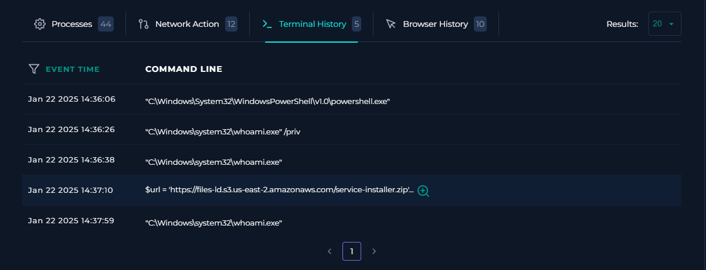

### SOC335 – CVE-2024-49138 Exploitation Detected

### Incident Summary

A medium-severity alert was generated after the execution of a suspicious executable named svohost.exe on host Victor (172.16.17.207). Initial threat intelligence analysis identified the file as malicious, with 44 security vendors detecting it as Trojan.Ulise.

Further investigation revealed that the executable was downloaded through PowerShell, executed from a temporary directory, and subsequently spawned a new PowerShell process running under NT AUTHORITY\SYSTEM, indicating successful privilege escalation.

The observed activity was consistent with exploitation behavior associated with CVE-2024-49138, leading to the classification of the alert as a True Positive.

**Alert Information**

**Investigation Methodology**

The investigation focused on answering three key questions:

- Is the detected file malicious?
- Was CVE-2024-49138 actually exploited?
- Did privilege escalation occur successfully?

### Phase 1 – Threat Intelligence Analysis

The file hash was analyzed using VirusTotal.

**Findings**

- SHA256
- b432dcf4a0f0b601b1d79848467137a5e25cab5a0b7b1224be9d3b6540122db9
- Results:
  - 44/67 security vendors flagged the file as malicious.
  - Multiple detections identified the sample as Trojan.Ulise.
  - Alert description associated the sample with exploitation activity related to CVE-2024-49138.
 

Assessment: The reputation analysis strongly indicated that the file represented a legitimate security threat rather than a false positive.

### Phase 2 – Process Timeline Reconstruction

User Reconnaissance Activity

Prior to executing the malware, the user launched PowerShell and executed the following commands:

- whoami /priv
- whoami

**Analysis**

These commands are commonly used to:

- Identify the current user context.
- numerate available privileges.
- Verify whether privilege escalation has succeeded.

**MITRE ATT&CK**

- T1033 – System Owner/User Discovery

- Malware Download

- Shortly afterward, PowerShell downloaded an archive from: https://files-ld.s3.us-east-2.amazonaws.com/service-installer.zip

The archive was extracted to: C:\temp\service_installer\

**Analysis**

This activity indicates the delivery stage of the attack, where a payload is transferred to the victim host before execution.

**MITRE ATT&CK**

- T1105 – Ingress Tool Transfer

- Malware Execution

The downloaded executable was launched: C:\temp\service_installer\svohost.exe

**Observations**

The filename closely resembles the legitimate Windows process: svchost.exe

However, several indicators suggested malicious intent:

- Indicator	Observation
- Name	svohost.exe
- Legitimate Process	svchost.exe
- Execution Directory	C:\temp
- Expected Directory	C:\Windows\System32

Analysis

The attacker appears to have intentionally chosen a filename visually similar to a legitimate Windows process in an attempt to evade casual inspection.

**MITRE ATT&CK**

- T1036 – Masquerading

### Phase 3 – Privilege Escalation Verification

The most significant finding occurred after execution of the malicious binary.

Initial Context

The malware was executed by:

EC2AMAZ-ILGVOIN\Victor

Process chain:

Victor
└── powershell.exe
    └── svohost.exe
Escalated Context

Approximately 42 seconds later, a new PowerShell process appeared.

Process details:

Process User:
NT AUTHORITY\SYSTEM

Parent Process:
svohost.exe

Process chain:

Victor
└── powershell.exe
    └── svohost.exe
        └── powershell.exe (SYSTEM)

Analysis

- This represents a privilege transition from a standard user context to the highest local privilege level available on Windows.

- The parent-child relationship directly links the malicious executable to the creation of the SYSTEM-level PowerShell process.

- This evidence strongly suggests successful exploitation resulting in privilege escalation.

**MITRE ATT&CK**

- T1068 – Exploitation for Privilege Escalation

Evidence Supporting True Positive Classification

The alert was classified as a True Positive based on the following evidence:

**Malware Indicators**

- Malicious SHA256 hash.
- 44 VirusTotal detections.
- Trojan.Ulise classification.

**Behavioral Indicators**

- PowerShell download activity.
- Execution from a temporary directory.
- Masquerading through a deceptive filename.

**Privilege Escalation Indicators**

- User context changed from Victor to NT AUTHORITY\SYSTEM.
- SYSTEM PowerShell process spawned directly from the malicious executable.
- Behavior consistent with exploitation of CVE-2024-49138.

**Indicators of Compromise (IOC)**

**Host:**

- Hostname: Victor
- IP Address: 172.16.17.207

**File**

- Filename: svohost.exe
- Path: C:\temp\service_installer\svohost.exe
- SHA256: b432dcf4a0f0b601b1d79848467137a5e25cab5a0b7b1224be9d3b6540122db9

- Download Source: https://files-ld.s3.us-east-2.amazonaws.com/service-installer.zip

**MITRE ATT&CK Mapping**

- Technique ID | Technique
- T1033	System Owner | User Discovery
- T1059.001	| PowerShell
- T1105	| Ingress Tool Transfer
- T1036	| Masquerading
- T1068	| Exploitation for Privilege Escalation

**Timeline**

- Time      |	Event
- 14:36:26	| User executes whoami /priv
- 14:36:39	| User executes whoami
- 14:37:10	| PowerShell downloads service-installer.zip
- 14:37:12	| svohost.exe executed
- 14:37:12	| Malicious hash detected
- 14:37:54	| SYSTEM PowerShell process spawned by svohost.exe
- 14:38+	  | Microsoft Defender activity observed

### Lessons Learned

This investigation demonstrated the importance of validating alerts through behavioral evidence rather than relying solely on threat intelligence.

Although the malicious hash provided an initial indication of compromise, the decisive evidence came from process telemetry showing a direct transition from a standard user context to NT AUTHORITY\SYSTEM.

The case also highlighted several common attacker techniques, including PowerShell-based payload delivery, process masquerading, and exploitation for privilege escalation.

### Analyst Conclusion

The investigation confirmed that a malicious executable associated with Trojan.Ulise was downloaded and executed on the endpoint. Analysis of process activity demonstrated a successful transition from a standard user context to NT AUTHORITY\SYSTEM, providing strong evidence of privilege escalation.

The alert was classified as a True Positive and escalated for incident response and containment activities.

