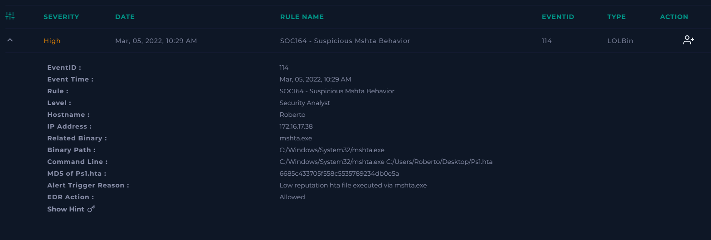
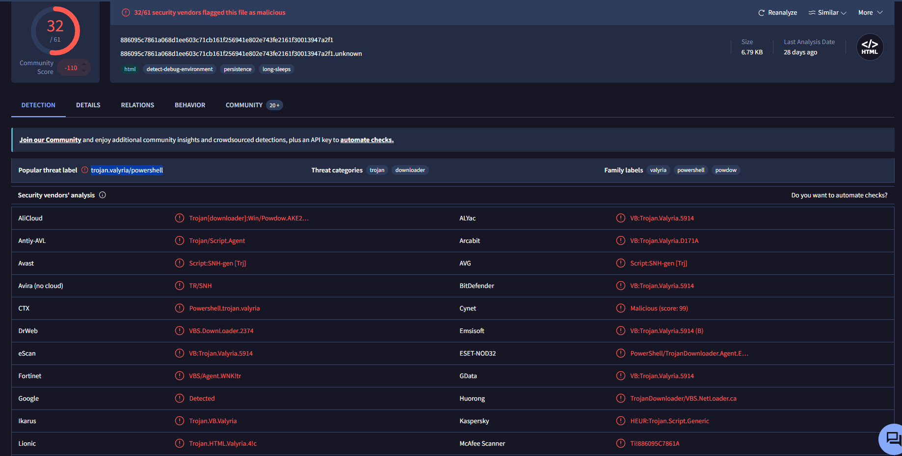
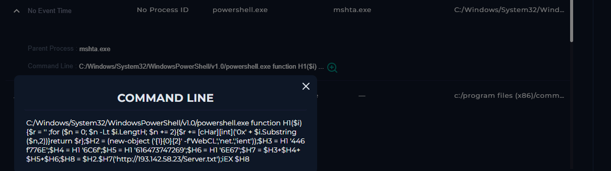
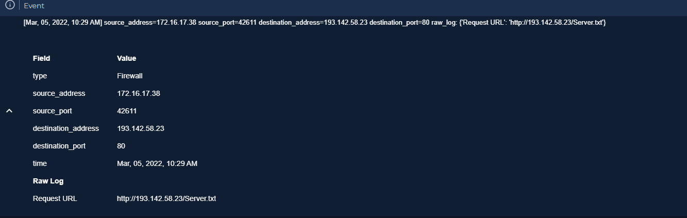

# SOC164 – Suspicious mshta.exe Behavior

## Executive Summary

This investigation analyzed a **high-severity Living-off-the-Land (LotL) attack** involving the abuse of the legitimate Windows binary **`mshta.exe`** to execute a suspicious HTA file.

The investigation began after endpoint telemetry detected **`mshta.exe`** launching an HTA file located on the user's desktop. By correlating **file reputation**, **process execution**, **PowerShell activity**, and **endpoint telemetry**, I confirmed that the HTA file launched an obfuscated PowerShell script designed to download additional content from attacker-controlled infrastructure using **PowerShell WebClient**.

The downloaded content was intended to be executed directly in memory through **Invoke-Expression (IEX)**, a technique frequently used during malware staging to avoid writing payloads to disk.

Although the remote server returned an **HTTP 404** response during the investigation, the observed behavior closely matched known malware delivery techniques and Living-Off-the-Land attack patterns.

Based on the available evidence, the incident was classified as a **True Positive** and escalated for Incident Response.


# Alert Overview



| Field | Value |
|---------|--------|
| Severity | High |
| Category | LOLBin Abuse / Malware |
| Rule | SOC164 – Suspicious mshta.exe Behavior |
| Related Binary | mshta.exe |
| Suspicious File | Ps1.hta |
| File MD5 | 6685c433705f558c553578923f4db0e5a |
| Detection Source | Endpoint Security |
| Initial Command | `C:\Windows\System32\mshta.exe C:\Users\Roberto\Desktop\Ps1.hta` |
| File Reputation | Low Reputation HTA |


# Investigation Timeline

| Time | Activity |
|------|----------|
| 10:29 | mshta.exe executed the HTA file |
| 10:29 | HTA spawned PowerShell |
| 10:29 | Obfuscated PowerShell command identified |
| 10:29 | PowerShell created a WebClient object |
| 10:29 | Outbound request sent to attacker infrastructure |
| 10:29 | Remote payload intended for in-memory execution |


# Technical Investigation

## Step 1 – Initial Alert Validation

The investigation began after endpoint telemetry detected the execution of the following command:

```cmd
C:\Windows\System32\mshta.exe C:\Users\Roberto\Desktop\Ps1.hta
```

The alert immediately raised suspicion because it involved two components commonly abused by threat actors:

- **mshta.exe**, a legitimate Microsoft binary frequently used as a Living-off-the-Land Binary (LOLBin);
- an **HTA (HTML Application)** file with low reputation executed directly from the user's Desktop.

HTA files are capable of executing VBScript or JScript with the user's privileges and are commonly abused to initiate malware execution while bypassing traditional application controls.

### Initial Assessment

At this stage, the alert presented a high probability of malicious activity.

However, additional investigation was required to determine:

- whether the HTA file was malicious;
- what child processes were created;
- whether additional payloads were downloaded;
- whether execution progressed beyond the initial stage.


## Step 2 – File Reputation Analysis

The next phase focused on validating the reputation of the HTA file.

The MD5 hash:

```
6685c433705f558c553578923f4db0e5a
```

was investigated using external threat intelligence.

The sample was classified as:

```
Trojan.Valyria/Powershell
```

Although reputation alone cannot determine whether compromise occurred, it provided additional context supporting the suspicious nature of the file.

### Reputation Findings



| Indicator | Result |
|------|------|
| File | Ps1.hta |
| MD5 | 6685c433705f558c553578923f4db0e5a |
| Detection | Trojan.Valyria/Powershell |
| Reputation | Suspicious |

### Analyst Assessment

The reputation results significantly increased confidence that the HTA file was malicious.

Nevertheless, endpoint telemetry remained the primary source for determining whether malicious execution actually occurred.


## Step 3 – Process Tree Analysis

The endpoint process history revealed the following execution chain:

```text
Ps1.hta
        │
        ▼
mshta.exe
        │
        ▼
powershell.exe
```

This parent-child relationship is highly unusual during normal Windows operation.

While **mshta.exe** is a legitimate Microsoft utility, its primary purpose is executing HTA applications.

In modern enterprise environments, HTA execution is relatively uncommon, making this process chain particularly suspicious.

### Why this is Suspicious

Several indicators immediately stood out:

- HTA executed through mshta.exe.
- PowerShell launched directly by the HTA application.
- Multiple scripting engines chained together.
- Behavior consistent with malware staging.

### Analyst Assessment

The process tree demonstrated that execution progressed beyond simply opening the HTA file.

Instead, the HTA acted as a launcher responsible for initiating PowerShell execution, indicating the beginning of a multi-stage attack chain.


## Step 4 – PowerShell Analysis

The PowerShell command executed by the HTA revealed additional evidence of malicious behavior.

The decoded script performed the following actions:

- Created a **PowerShell WebClient** object.
- Connected to external infrastructure.
- Attempted to download a remote payload.
- Executed the downloaded content directly in memory using **Invoke-Expression (IEX)**.

### Relevant Script Components



```powershell
New-Object Net.WebClient
```

```powershell
http://193.142.58.23/Server.txt
```

```powershell
IEX
```

### Why this is Suspicious

This execution pattern is commonly known as a **PowerShell Download Cradle**.

Rather than storing malware on disk, the script retrieves remote content and immediately executes it in memory.

This technique offers several advantages for attackers:

- reduced forensic artifacts;
- lower probability of antivirus detection;
- rapid payload delivery;
- easier deployment of additional malware stages.

### Analyst Assessment

This represented the strongest endpoint evidence identified during the investigation.

At this stage, the investigation had already confirmed:

- LOLBin abuse;
- malicious PowerShell execution;
- outbound payload retrieval;
- intended in-memory execution.

The remaining objective was validating the associated network activity and correlating all available evidence into a complete attack chain.


## Step 5 – Network Activity Correlation

The final phase of the investigation focused on validating whether the PowerShell download cradle generated outbound communication with external infrastructure.

Firewall telemetry revealed that the affected endpoint attempted to retrieve remote content from the same server referenced in the PowerShell script.

### Network Evidence



| Field | Value |
|------|------|
| Source IP | 172.16.17.38 |
| Destination IP | 193.142.58.23 |
| Destination Port | 80 |
| Requested Resource | `/Server.txt` |
| Network Device | Firewall |
| Action | Allowed |

The requested resource returned:

```
HTTP 404 Not Found
```

during the investigation.

### Why this is Significant

Although the remote file was unavailable at the time of analysis, the HTTP response does **not** invalidate the attack.

Instead, it confirms that:

- the endpoint attempted outbound communication;
- the PowerShell script reached the payload retrieval stage;
- attacker-controlled infrastructure was successfully contacted.

The absence of the payload may simply indicate that:

- the attacker removed the payload after execution;
- the server became unavailable;
- the infrastructure was intentionally dismantled.

### Analyst Assessment

The firewall telemetry successfully validated the network stage of the attack chain.

While the payload itself could not be recovered, sufficient evidence existed to confirm the attacker's intent and the malware delivery attempt.


# Evidence Correlation

No single artifact was used to classify this incident.

Instead, multiple independent telemetry sources were correlated throughout the investigation.

## File Reputation Evidence

✅ HTA file classified as:

```
Trojan.Valyria/Powershell
```


## Endpoint Evidence

✅ HTA executed through **mshta.exe**

✅ PowerShell spawned by the HTA

✅ Obfuscated PowerShell identified

## PowerShell Evidence

✅ WebClient object created

✅ Remote payload requested

✅ Invoke-Expression (IEX) identified

## Network Evidence

✅ Firewall confirmed outbound communication.

✅ Request matched the URL referenced in the PowerShell command.

✅ Remote infrastructure contacted successfully.


## Attack Chain Reconstruction

The investigation reconstructed the following execution chain:

```text
HTA File
      │
      ▼
mshta.exe
      │
      ▼
PowerShell
      │
      ▼
WebClient
      │
      ▼
HTTP Request
      │
      ▼
Remote Payload
      │
      ▼
Invoke-Expression (IEX)
```

This execution flow closely matches publicly documented malware staging techniques frequently observed during Living-Off-the-Land attacks.


## Analyst Conclusion

The investigation demonstrated a complete malware staging sequence involving:

- execution of a malicious HTA file;
- abuse of the legitimate Windows binary **mshta.exe**;
- PowerShell execution;
- outbound payload retrieval;
- intended in-memory execution through **Invoke-Expression (IEX)**.

Although the remote payload was no longer available during analysis, sufficient endpoint and network evidence confirmed that the attack progressed into the malware delivery stage.

The incident was therefore classified as a **True Positive** requiring Incident Response.


# MITRE ATT&CK Techniques Identified

| Tactic | Technique | ID | Evidence from Investigation |
|---------|-----------|------|----------------------------|
| Execution | Signed Binary Proxy Execution: Mshta | **T1218.005** | The attacker abused the legitimate Windows binary `mshta.exe` to execute a malicious HTA application. |
| Execution | Command and Scripting Interpreter: PowerShell | **T1059.001** | The HTA launched PowerShell to execute a malicious download cradle. |
| Defense Evasion | Obfuscated Files or Information | **T1027** | PowerShell employed obfuscated scripting techniques to conceal malicious behavior. |
| Command and Control | Ingress Tool Transfer | **T1105** | PowerShell attempted to retrieve a remote payload from attacker-controlled infrastructure. |
| Execution | Command and Scripting Interpreter | **T1059** | The attack relied on Windows scripting interpreters to execute attacker-controlled code. |


# Indicators of Compromise (IoCs)

## File Indicators

| Type | Indicator |
|------|-----------|
| File | `Ps1.hta` |
| MD5 | `6685c433705f558c553578923f4db0e5a` |


## Process Indicators

| Type | Indicator |
|------|-----------|
| LOLBin | `mshta.exe` |
| Child Process | `powershell.exe` |


## Network Indicators

| Type | Indicator |
|------|-----------|
| IP Address | `193.142.58.23` |
| URL | `http://193.142.58.23/Server.txt` |


## Script Indicators

| Type | Indicator |
|------|-----------|
| PowerShell Function | `New-Object Net.WebClient` |
| Execution Method | `Invoke-Expression (IEX)` |


# Incident Classification

| Field | Value |
|------|------|
| Classification | **True Positive** |
| Severity | High |
| Attack Type | LOLBin Abuse / Malware Staging |
| Escalated to IR | Yes |


# Escalation Note

**True Positive.**

The investigation confirmed the malicious execution of a low-reputation HTA file through **mshta.exe**, a legitimate Windows binary frequently abused by threat actors.

Endpoint telemetry revealed that the HTA launched **PowerShell**, which created a **WebClient** object to retrieve additional content from external infrastructure before attempting in-memory execution using **Invoke-Expression (IEX)**.

Firewall telemetry confirmed outbound communication with the same infrastructure referenced in the PowerShell script, validating the malware delivery stage despite the remote payload returning **HTTP 404** during the investigation.

Based on the correlation between **file reputation**, **endpoint telemetry**, **PowerShell activity**, and **network evidence**, the incident was classified as a confirmed **True Positive** and escalated to the Incident Response team.


# Recommendations

- Immediately isolate the affected endpoint.
- Block communication with the identified external infrastructure.
- Investigate additional PowerShell execution across the environment.
- Hunt for HTA file execution and **mshta.exe** abuse on other endpoints.
- Review persistence mechanisms and scheduled tasks.
- Scan the environment for additional malware stages or secondary payloads.


# Lessons Learned

- Legitimate Windows binaries such as **mshta.exe** should always be evaluated within their execution context, as they are frequently abused as **Living-off-the-Land Binaries (LOLBins)**.
- PowerShell download cradles combining **WebClient** and **Invoke-Expression (IEX)** are strong indicators of malware staging and should be treated as high-confidence malicious behavior.
- A missing payload (**HTTP 404**) does not invalidate an investigation when sufficient endpoint and network evidence demonstrate attacker intent and execution.
- Correlating process lineage, PowerShell activity, and network telemetry provides significantly higher confidence than analyzing any single indicator in isolation.


# Key Takeaways

This investigation demonstrates how threat actors abuse legitimate Windows components to deliver malware while minimizing forensic artifacts.

By correlating **file reputation**, **process execution**, **PowerShell telemetry**, and **network activity**, the investigation successfully reconstructed a complete malware staging sequence involving **HTA execution**, **LOLBin abuse**, **PowerShell download cradles**, and **attempted in-memory execution**.

The case highlights the importance of understanding **behavior** rather than relying solely on file signatures when investigating modern malware attacks.
