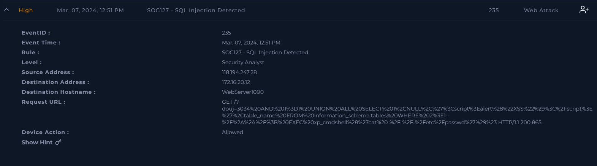
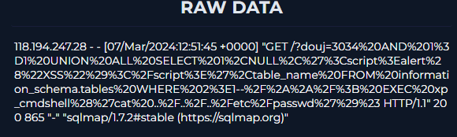
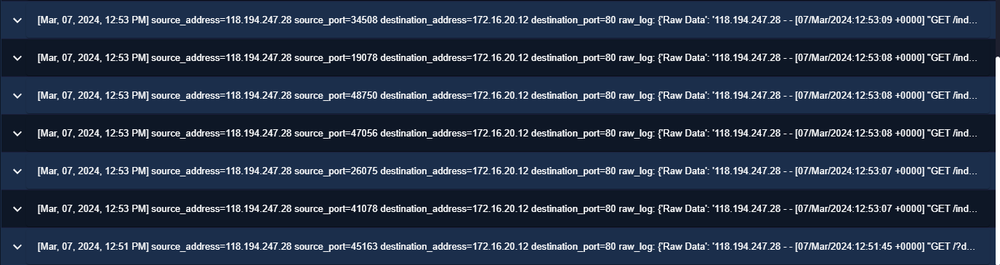

# SQL Injection Attempt Detected (SOC127)

## Scenario Overview

A high-severity alert was generated after multiple HTTP requests containing SQL injection payloads were detected against a public-facing web application. Investigation revealed that the attacker used sqlmap, an automated SQL injection exploitation framework, to probe the target application for SQL injection vulnerabilities.

Analysis of web server logs identified multiple SQL injection techniques, including:

- Boolean-based SQL Injection
- Error-based SQL Injection
- UNION-based SQL Injection
- Database enumeration attempts
- File read attempts
- Command execution attempts using xp_cmdshell

The activity was classified as a True Positive SQL Injection attack.

| Field           | Value                           |
| --------------- | ------------------------------- |
| Alert Name      | SOC127 - SQL Injection Detected |
| Severity        | High                            |
| Category        | Web Attack                      |
| Detection Time  | Mar 07, 2024                    |
| Source IP       | 118.194.247.28                  |
| Target Host     | WebServer1000                   |
| Target IP       | 172.16.20.12                    |
| Tool Identified | sqlmap 1.7.2                    |
| Disposition     | True Positive                   |

## Investigation Process

### 1. Initial Alert Review

The alert was triggered due to multiple suspicious HTTP requests containing SQL syntax commonly associated with SQL injection attacks.

Initial indicators included:

- UNION SELECT statements
- EXTRACTVALUE function abuse
- information_schema enumeration
- CASE WHEN logic testing
- CAST and CHR obfuscation techniques

### 2. Web Log Analysis

Multiple requests were identified originating from the same source IP.

Example:

GET /index.php?id=1 AND EXTRACTVALUE(...)
User-Agent: sqlmap/1.7.2

The User-Agent clearly identified the tool used during the attack: sqlmap/1.7.2#stable

### 3. SQL Injection Validation

The attacker performed multiple SQL injection tests using:

- Boolean-Based SQL Injection
- CASE WHEN (2574=2574) THEN 1 ELSE 0 END

Purpose:

Determine whether injected SQL statements are executed by the application.

- Error-Based SQL Injection
- EXTRACTVALUE(...)

Purpose:

Trigger database errors to disclose information.

- UNION-Based SQL Injection
- UNION ALL SELECT

Purpose:

Retrieve information from backend database tables.

### 4. Database Enumeration Attempts

The attacker attempted to enumerate database objects using:

- information_schema.tables

This indicates progression beyond initial vulnerability testing.

### 5. Command Execution Attempts

One payload included:

- EXEC xp_cmdshell(...)

Attempted command:

- cat ../../../etc/passwd

Observed behavior suggests an automated exploitation framework attempting multiple attack vectors simultaneously.

No evidence was found that command execution was successful.

### 6. HTTP Response Analysis

All requests received:

- HTTP/1.1 200 OK

This suggests:

- Requests were accepted and processed.
- SQL payloads reached the application layer.
- The attack likely interacted with the backend database.

No evidence was available to confirm data exfiltration or successful command execution.

## IoCs

| Type                 | Value                     |
| -------------------- | ------------------------- |
| Source IP            | 118.194.247.28            |
| User-Agent           | sqlmap/1.7.2#stable       |
| URI Pattern          | /index.php?id=            |
| SQL Function         | EXTRACTVALUE              |
| SQL Function         | UNION SELECT              |
| SQL Function         | xp_cmdshell               |
| Database Enumeration | information_schema.tables |

## MITRE ATT&CK Mapping

| Tactic         | Technique                          | ID    |
| -------------- | ---------------------------------- | ----- |
| Initial Access | Exploit Public-Facing Application  | T1190 |
| Discovery      | Software Discovery                 | T1518 |
| Discovery      | System Information Discovery       | T1082 |
| Execution      | Command and Scripting Interpreter  | T1059 |
| Collection     | Data from Information Repositories | T1213 |

## Attack Timeline

| Time (UTC) | Activity                                |
| ---------- | ----------------------------------------|
| 12:51 | Automated attack begins                      |
| 12:53 | UNION SELECT payload observed                |
| 12:53 | Input validation testing                     |
| 12:53 | Boolean-based SQL Injection testing          |
| 12:53 | Error-based SQL Injection using EXTRACTVALUE |
| 12:53 | Database response validation                 |
| 12:53 | Advanced SQL payload execution               |
| 12:53 | sqlmap enumeration attempts continue         |

### Findings

**Confirmed**
- SQL Injection attack attempt
- Use of sqlmap automation framework
- Database enumeration attempts
- Attempts to access database metadata
- Attempts to execute operating system commands
- HTTP responses indicate payloads were processed

**Not Confirmed**
- Data exfiltration
- Successful command execution
- Database dump
- Server compromise
- Persistence

## Analyst Assessment

Investigation confirmed a True Positive SQL Injection attack conducted using the automated exploitation framework sqlmap.

The attacker successfully delivered SQL payloads to the target application and progressed through multiple phases of exploitation, including vulnerability validation, database enumeration, and command execution attempts.

Although there was no evidence of post-exploitation activity, data theft, or operating system compromise, the application demonstrated behavior consistent with a vulnerable SQL injection attack surface.

