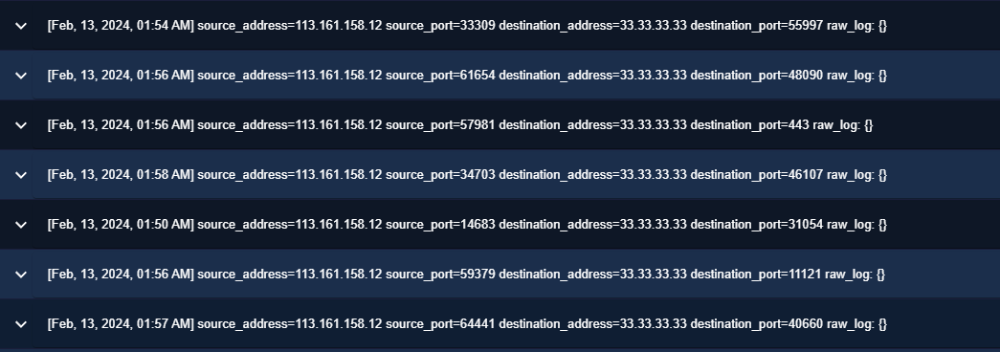
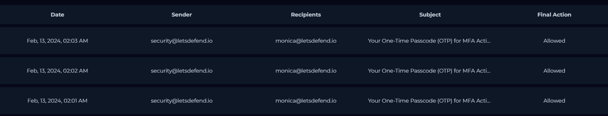
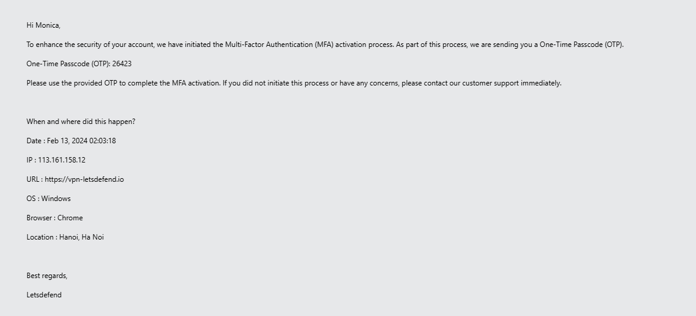
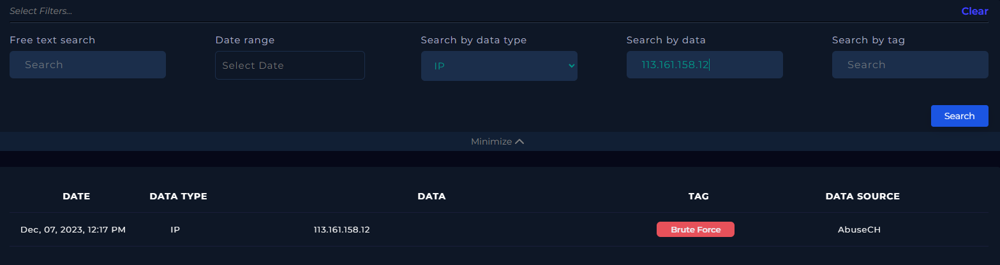

# SOC257 – Unauthorized VPN Authentication Attempt

## Executive Summary

This investigation analyzed a **low-severity authentication alert** involving repeated VPN login attempts originating from an unauthorized country.

The investigation began after VPN telemetry detected authentication attempts against a corporate account from **Hanoi, Vietnam**. By correlating **VPN logs**, **authentication events**, **email security telemetry**, and **threat intelligence**, I confirmed that the attacker repeatedly attempted to authenticate using valid account credentials but failed during the Multi-Factor Authentication (MFA) stage.

Multiple OTP emails were generated for the targeted user, while authentication logs consistently recorded **Incorrect OTP Code** events.

Although no successful VPN session or account compromise was identified, the investigation demonstrated a clear attempted unauthorized access against a legitimate corporate account.

Based on the available evidence, the incident was classified as a **True Positive** and escalated for Incident Response.


# Alert Overview


| Field | Value |
|---------|--------|
| Severity | Low |
| Category | Unauthorized Access |
| Rule | SOC257 – VPN Connection Detected from Unauthorized Country |
| Detection Time | Feb 13, 2024 – 02:04 AM |
| Source IP | 113.161.158.12 |
| Destination IP | 33.33.33.33 |
| Target User | monica@letsdefend.io |
| VPN Portal | vpn-letsdefend.io |
| Detection Source | VPN Authentication Logs |
| Classification | True Positive |


# Investigation Timeline

| Time | Activity |
|------|----------|
| 01:50 | Initial VPN authentication attempt observed |
| 01:54–01:58 | Multiple repeated authentication attempts |
| 02:01 | First MFA OTP generated |
| 02:02 | Second MFA OTP generated |
| 02:03 | Third MFA OTP generated |
| 02:03 | Authentication failed (Incorrect OTP) |
| 02:04 | SOC257 alert generated |


# Technical Investigation

## Step 1 – Initial Alert Validation

The investigation began after a VPN security alert detected an authentication attempt originating from an unauthorized country.

The affected account was:

```
monica@letsdefend.io
```

The authentication originated from:

```
113.161.158.12
```

located in:

```
Hanoi, Vietnam
```

Several characteristics immediately increased the confidence level of the alert:

- Authentication originated from an unauthorized country.
- Corporate VPN account targeted.
- External source IP.
- Authentication activity occurred outside the organization's expected geographic region.

### Initial Assessment

At this stage, the investigation focused on answering four questions:

- Was Monica legitimately traveling?
- Was this a malicious authentication attempt?
- Was MFA successfully bypassed?
- Did the attacker successfully establish a VPN session?


## Step 2 – VPN Authentication Analysis

VPN logs revealed repeated authentication attempts originating from the same external IP address.

Observed authentication attempts occurred between:

- 01:50 AM
- 01:54 AM
- 01:56 AM
- 01:57 AM
- 01:58 AM
- 02:03 AM

Rather than a single login attempt, the activity demonstrated multiple consecutive authentication attempts within a short period.

### VPN Evidence



| Field | Value |
|------|------|
| Source IP | 113.161.158.12 |
| Destination | vpn-letsdefend.io |
| Destination IP | 33.33.33.33 |
| Authentication Attempts | Multiple |
| Time Window | Approximately 13 minutes |

### Analyst Assessment

The authentication pattern was inconsistent with typical user behavior.

Repeated login attempts strongly suggested an actor repeatedly attempting to authenticate using the same account credentials.


## Step 3 – MFA Validation


Authentication logs revealed one of the most important findings of the investigation.

The VPN recorded:

```
Incorrect OTP Code
```

for the account:

```
monica@letsdefend.io
```

### Why this is Significant

This event confirms that the attacker successfully reached the **Multi-Factor Authentication (MFA)** stage.

This means:

- the username was valid;
- the primary authentication step had already progressed far enough to trigger MFA;
- the attacker attempted to submit an OTP code;
- the submitted OTP was rejected.

Unlike simple VPN scanning, this represented an active authentication attempt against a legitimate user account.

### Analyst Assessment

This finding significantly increased confidence that the activity represented an attempted unauthorized access rather than benign VPN traffic.

The investigation had now confirmed:

- repeated VPN authentication attempts;
- valid targeted account;
- failed MFA challenge.

The remaining objective was determining whether the repeated MFA events could be corroborated through additional telemetry.


## Step 4 – Email Security Correlation

The next phase focused on validating whether the VPN authentication attempts generated MFA notifications.




Email Security logs revealed that the account received:

- three MFA OTP emails;
- within approximately two minutes;
- corresponding to the authentication attempts.


One of the messages included:

- Source IP: **113.161.158.12**
- Browser: Chrome
- Operating System: Windows
- Location: Hanoi, Vietnam
- VPN Portal: vpn-letsdefend.io



### Why this is Significant

This was one of the strongest findings identified during the investigation.

The MFA emails independently confirmed that:

- the authentication flow progressed to MFA;
- the targeted account belonged to Monica;
- the source IP matched the VPN logs;
- the geolocation matched the alert.

Unlike relying on authentication logs alone, the email telemetry independently validated the same authentication sequence.

### Analyst Assessment

At this stage, multiple independent telemetry sources had already confirmed that the activity represented a real unauthorized authentication attempt rather than an isolated false positive.

The remaining objective was enriching the source IP through Threat Intelligence and determining whether any evidence suggested successful account compromise.

## Step 5 – Threat Intelligence Enrichment

The final investigative phase focused on enriching the source IP address using Threat Intelligence.

The address:

```
113.161.158.12
```

was analyzed using both **LetsDefend Threat Intelligence** and **VirusTotal**.



### Threat Intelligence Findings

| Source | Result |
|------|------|
| LetsDefend Threat Intelligence | Tagged as **Brute Force** |
| VirusTotal | 7 / 91 vendors flagged the IP as suspicious |
| ISP | VNPT Corp |
| Geolocation | Hanoi, Vietnam |

Although only a limited number of security vendors classified the IP as malicious, threat intelligence should never be used in isolation.

Instead, it served as supporting evidence when correlated with:

- repeated VPN authentication attempts;
- repeated MFA challenge generation;
- failed OTP submissions;
- unauthorized geolocation.

### Analyst Assessment

Threat Intelligence strengthened confidence in the investigation but was not used as the sole basis for classification.

The incident was classified using the complete set of available evidence rather than reputation data alone.


# Evidence Correlation

No single log entry was sufficient to classify this incident.

Instead, multiple independent telemetry sources were correlated throughout the investigation.

## VPN Authentication Evidence

✅ Multiple authentication attempts observed.

✅ Repeated login attempts from the same external IP.


## Authentication Evidence

✅ Incorrect OTP Code recorded.

✅ Authentication reached the MFA stage.


## Email Security Evidence

✅ Three MFA emails generated.

✅ Same username.

✅ Same source IP.

✅ Same VPN portal.

✅ Same geolocation.


## Threat Intelligence Evidence

✅ Source IP associated with brute-force activity.

✅ Reputation consistent with suspicious authentication attempts.


## What Was Confirmed

✅ Attempted authentication against a legitimate VPN account.

✅ MFA challenge successfully triggered.

✅ Multiple failed OTP submissions.

✅ Unauthorized foreign source IP.


## What Was NOT Confirmed

❌ Successful VPN login.

❌ MFA bypass.

❌ Account compromise.

❌ Endpoint compromise.

❌ Data access.

❌ Data exfiltration.


## Analyst Conclusion

The investigation demonstrated a repeated unauthorized authentication attempt targeting a legitimate corporate VPN account.

Multiple telemetry sources independently confirmed that the attacker progressed through the authentication workflow until the Multi-Factor Authentication challenge.

However, every available source consistently showed failed OTP validation, and no evidence indicated that the attacker successfully established a VPN session.

The alert was therefore classified as a **True Positive attempted unauthorized access**, not as a confirmed account compromise.


# MITRE ATT&CK Techniques Identified

| Tactic | Technique | ID | Evidence from Investigation |
|---------|-----------|------|----------------------------|
| Credential Access | Brute Force | **T1110** | Multiple consecutive VPN authentication attempts were observed from the same external IP address targeting a single user account. |
| Initial Access | Valid Accounts | **T1078** | The attacker attempted to authenticate using what appears to have been a valid corporate username before failing during MFA validation. |


# Indicators of Compromise (IoCs)

## Network Indicators

| Type | Indicator |
|------|-----------|
| Source IP | `113.161.158.12` |
| Destination IP | `33.33.33.33` |
| VPN Portal | `https://vpn-letsdefend.io` |


## Authentication Indicators

| Type | Indicator |
|------|-----------|
| Username | `monica@letsdefend.io` |
| Authentication Result | `Incorrect OTP Code` |
| MFA Emails | 3 Generated |


## Threat Intelligence Indicators

| Type | Indicator |
|------|-----------|
| Threat Intel Tag | `Brute Force` |
| Geolocation | Hanoi, Vietnam |
| ISP | VNPT Corp |


# Incident Classification

| Field | Value |
|------|------|
| Classification | **True Positive** |
| Severity | Low |
| Attack Type | Unauthorized VPN Authentication Attempt |
| MFA Status | Failed |
| VPN Login | Not Successful |
| Escalated to IR | Yes |


# Escalation Note

**True Positive.**

The investigation confirmed repeated unauthorized VPN authentication attempts targeting the corporate account **monica@letsdefend.io** from an external IP located in **Hanoi, Vietnam**.

VPN authentication logs, MFA telemetry, email security evidence, and Threat Intelligence consistently demonstrated that the attacker repeatedly attempted to authenticate using the victim's account.

Authentication progressed to the Multi-Factor Authentication stage, generating multiple OTP emails, but every attempt resulted in **Incorrect OTP Code**, preventing successful access.

No evidence indicated a successful VPN login, MFA bypass, account compromise, or endpoint compromise.

Based on the correlation of authentication logs, email telemetry, and threat intelligence, the incident was classified as a confirmed **attempted unauthorized VPN authentication** requiring continued monitoring and Incident Response review.


# Recommendations

- Contact the affected user to verify whether the login attempts were legitimate.
- Immediately reset credentials if credential exposure is suspected.
- Review subsequent VPN authentication events for successful logins.
- Block or monitor the identified source IP.
- Review failed MFA events across the organization for similar activity.
- Monitor the account for future authentication attempts originating from unusual locations.


# Lessons Learned

- Authentication investigations should rely on multiple telemetry sources rather than VPN logs alone.
- MFA email generation provides valuable evidence that authentication progressed beyond username and password validation.
- Threat Intelligence should always be treated as supporting context and not as definitive proof of malicious activity.
- Analysts should distinguish between **attempted unauthorized access** and **confirmed account compromise**, ensuring conclusions remain evidence-based.


# Key Takeaways

This investigation demonstrates the importance of correlating **VPN authentication logs**, **MFA telemetry**, **email security**, and **threat intelligence** when investigating suspicious login activity.

Rather than assuming compromise based solely on a foreign login attempt, the investigation reconstructed the complete authentication workflow and demonstrated that **Multi-Factor Authentication successfully prevented unauthorized access**.

The case highlights a fundamental SOC principle: **the absence of successful authentication is just as important as the presence of malicious login attempts**, allowing analysts to accurately classify incidents while avoiding unsupported conclusions.

At this stage, multiple independent telemetry sources had already confirmed that the activity represented a real unauthorized authentication attempt rather than an isolated false positive.

The remaining objective was enriching the source IP through Threat Intelligence and determining whether any evidence suggested successful account compromise.
