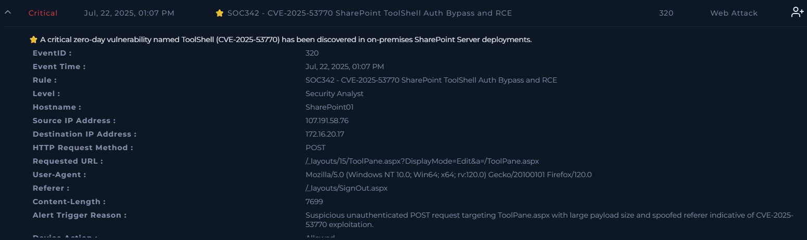
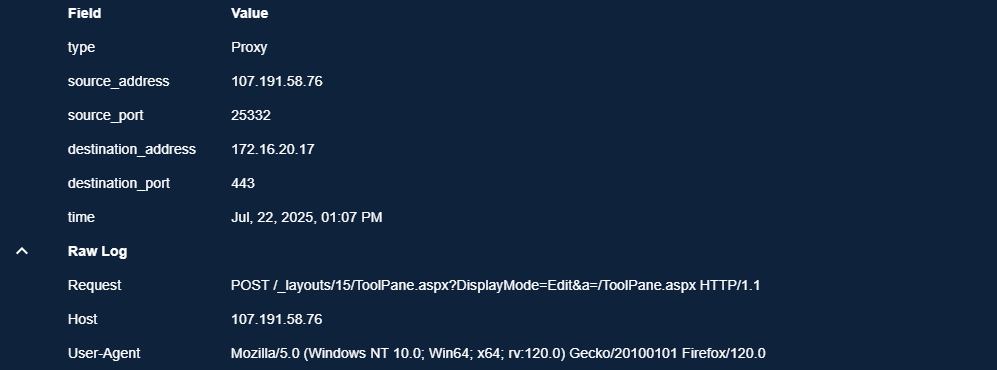
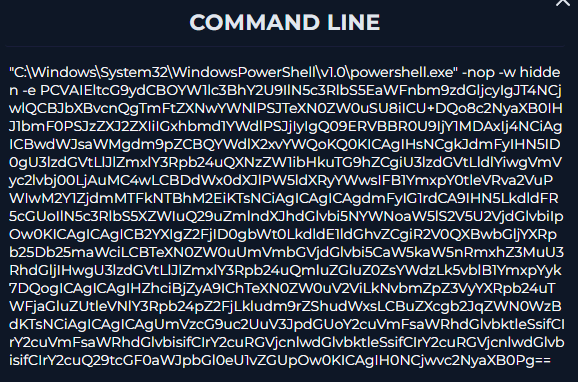
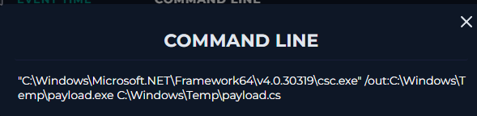
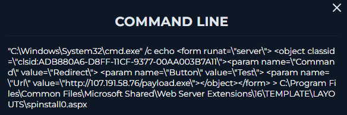
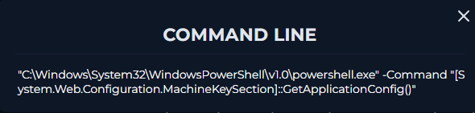

# SOC342 – SharePoint ToolShell Authentication Bypass & Remote Code Execution (CVE-2025-53770)

## Executive Summary

This investigation analyzed a **critical exploitation attempt targeting an on-premises Microsoft SharePoint Server** vulnerable to **CVE-2025-53770 (ToolShell Authentication Bypass & Remote Code Execution)**.

The investigation began with a suspicious unauthenticated HTTP POST request targeting **ToolPane.aspx**, a known exploitation vector associated with the ToolShell vulnerability. By correlating **proxy logs**, **endpoint telemetry**, and **PowerShell execution history**, multiple post-exploitation activities were identified.

The compromised SharePoint server executed **Base64-encoded PowerShell**, compiled a malicious payload using **csc.exe**, generated a rogue ASPX component capable of downloading attacker-controlled content, and accessed sensitive **ASP.NET MachineKey** configuration.

Based on the available evidence, the incident was classified as a **True Positive** representing a successful exploitation attempt requiring immediate Incident Response.



## Alert Overview

| Field | Value |
|---------|--------|
| Severity | Critical |
| Category | Web Attack |
| Rule | SOC342 – SharePoint ToolShell Authentication Bypass & RCE |
| CVE | CVE-2025-53770 |
| Target Host | SharePoint01 |
| Source IP | 107.191.58.76 |
| Destination IP | 172.16.20.17 |
| HTTP Method | POST |
| Request URI | /_layouts/15/ToolPane.aspx?DisplayMode=Edit&a=/ToolPane.aspx |
| Detection Source | Proxy Logs |
| Device Action | Allowed |


# Investigation Timeline

| Time | Activity |
|------|----------|
| 13:07 | Alert generated for suspicious POST request targeting ToolPane.aspx |
| 13:07 | Proxy logs reviewed and exploitation indicators identified |
| 13:08 | Endpoint investigation initiated |
| 13:08 | Encoded PowerShell execution identified |
| 13:08 | Payload compilation using csc.exe observed |
| 13:09 | Malicious ASPX component creation confirmed |
| 13:09 | ASP.NET MachineKey access detected |

# Investigation Objectives

The objective of this investigation was to determine:

- Whether the SharePoint server was targeted using CVE-2025-53770.
- Whether exploitation succeeded.
- Whether post-exploitation activity occurred.
- Whether attacker-controlled payloads were executed.
- Whether Incident Response escalation was required.

# Technical Investigation

## Step 1 – Initial Alert Validation

The initial alert detected an unauthenticated HTTP POST request directed to:

```

/_layouts/15/ToolPane.aspx

```

This endpoint is publicly associated with **ToolShell (CVE-2025-53770)** and has been widely abused to execute malicious payloads on vulnerable on-premises SharePoint servers.

Several characteristics immediately increased the confidence level of the alert:

- POST request targeting ToolPane.aspx
- Large HTTP request body (7699 bytes)
- Suspicious Referer header
- Internet-originated request
- Request matched the official ToolShell detection signature

### Initial Assessment

At this stage, the alert was considered highly suspicious but additional endpoint evidence was required before confirming successful exploitation.

---

## Step 2 – Proxy Log Analysis

The proxy logs confirmed that the malicious request reached the SharePoint server.

### Request Details

| Field | Value |
|------|------|
| Method | POST |
| Destination Port | 443 |
| Content-Type | application/x-www-form-urlencoded |
| Content-Length | 7699 |
| Referer | /_layouts/SignOut.aspx |
| User-Agent | Mozilla Firefox 120 |




The unusually large POST body combined with the ToolPane endpoint strongly aligned with known exploitation techniques for CVE-2025-53770.

### Analyst Assessment

The network evidence confirmed that the attacker successfully delivered the exploit request to the SharePoint server, justifying a deeper endpoint investigation.

## Step 3 – Endpoint Investigation

After confirming that the exploit request reached the SharePoint server, the investigation shifted to **endpoint telemetry** to determine whether the attacker achieved code execution.

The terminal history of **SharePoint01** revealed multiple suspicious commands executed shortly after the malicious HTTP request. Individually, each command would already warrant investigation; together, they formed a clear post-exploitation sequence.

---

### Finding 1 – Encoded PowerShell Execution

**Observed Command**



```powershell
powershell.exe -nop -w hidden -e <Base64 Payload>
```

### Why it is Suspicious

Several command-line arguments immediately stood out:

- **`-nop`** disables PowerShell profile loading, reducing execution artifacts.
- **`-w hidden`** hides the PowerShell console from the user.
- **`-e`** executes a Base64-encoded payload, concealing the actual script content.

This execution pattern is frequently observed during malware execution and post-exploitation because it helps attackers evade basic detection while executing arbitrary code.

### Analyst Assessment

This was the **first strong indicator that the attack progressed beyond a simple exploitation attempt**. The command strongly suggests attacker-controlled PowerShell execution on the compromised SharePoint server.


### Finding 2 – Payload Compilation using csc.exe

**Observed Command**



```cmd
csc.exe /out:C:\Windows\Temp\payload.exe C:\Windows\Temp\payload.cs
```

### Why it is Suspicious

`csc.exe` is Microsoft's legitimate C# compiler.

Although completely legitimate by itself, it becomes highly suspicious when used immediately after a SharePoint exploitation attempt.

The command compiles:

- **Input:** `payload.cs`
- **Output:** `payload.exe`

This indicates that source code was already present on the compromised server and was compiled into an executable directly on the host.

### Analyst Assessment

This behavior strongly suggests that the attacker leveraged server-side execution to compile a payload locally instead of transferring a finished executable.

Using native Microsoft binaries also helps blend malicious activity with legitimate operating system processes.

---

### Finding 3 – Malicious ASPX File Creation

**Observed Command**



```cmd
cmd.exe /c echo (...) > spinstall0.aspx
```

The generated ASPX file referenced:

```
http://107.191.58.76/payload.exe
```

### Why it is Suspicious

This finding represented the strongest artifact discovered during the investigation.

The command:

- created a new ASPX component inside the SharePoint web directory;
- referenced an external payload hosted on the same attacker infrastructure identified during the original alert;
- used native Windows utilities to stage additional malicious content.

Creating executable ASPX pages inside SharePoint directories is a well-known post-exploitation technique that enables attackers to deploy web-accessible components capable of executing arbitrary server-side code.

### Analyst Assessment

The direct relationship between:

- the original attacker IP,
- the downloaded payload,
- and the malicious ASPX file

provided compelling evidence that exploitation had already succeeded.

---

### Finding 4 – ASP.NET MachineKey Access

**Observed Command**



```powershell
[System.Web.Configuration.MachineKeySection]::GetApplicationConfig()
```

### Why it is Suspicious

The command retrieves the ASP.NET MachineKey configuration used by SharePoint.

Machine keys are security-sensitive because they participate in:

- application authentication,
- ViewState validation,
- cryptographic signing,
- protection of application secrets.

Although administrators may occasionally retrieve this information for troubleshooting purposes, its execution immediately after multiple confirmed malicious actions significantly changes its context.

### Analyst Assessment

Given the surrounding evidence, this command was assessed as part of attacker reconnaissance and post-exploitation rather than legitimate administrative activity.

The timing strongly suggests the attacker attempted to obtain sensitive application configuration after gaining code execution.


## Step 4 – Evidence Correlation

At this point, the investigation no longer relied on a single indicator.

Instead, multiple independent evidence sources converged into a single attack chain.

## Network Evidence

✅ External attacker targeted the SharePoint ToolPane endpoint.

✅ Crafted POST request matched known ToolShell exploitation patterns.


## Endpoint Evidence

✅ Encoded PowerShell execution.

✅ Hidden PowerShell window.

✅ Payload compilation using `csc.exe`.

✅ Malicious ASPX file creation.

✅ Access to ASP.NET MachineKey configuration.


## Infrastructure Correlation

✅ The malicious ASPX component referenced the same external infrastructure observed in the original exploitation request.

This direct relationship significantly increased confidence that all observed activities belonged to the same intrusion.

## MITRE ATT&CK Techniques Identified

| Tactic | Technique | ID | Evidence from Investigation |
|---------|-----------|------|----------------------------|
| Initial Access | Exploit Public-Facing Application | **T1190** | The attacker targeted the vulnerable SharePoint `ToolPane.aspx` endpoint using the ToolShell authentication bypass vulnerability (CVE-2025-53770). |
| Execution | Command and Scripting Interpreter: PowerShell | **T1059.001** | Base64-encoded PowerShell was executed using `-nop`, `-w hidden`, and `-e`, indicating attacker-controlled script execution. |
| Defense Evasion | Obfuscated/Compressed Files and Information | **T1027** | The malicious PowerShell payload was Base64 encoded to conceal its contents and hinder detection. |
| Defense Evasion | Signed Binary Proxy Execution | **T1218** | Native Microsoft binaries such as `csc.exe` were abused to compile attacker-controlled payloads, blending malicious activity with legitimate system processes. |
| Persistence | Server Software Component | **T1505.003** | A malicious ASPX component was created within the SharePoint web application to execute attacker-controlled code. |
| Discovery | System Information Discovery | **T1082** | The attacker accessed the ASP.NET MachineKey configuration, likely gathering information about the application's cryptographic configuration. |
| Command and Control | Ingress Tool Transfer | **T1105** | The malicious ASPX component referenced and downloaded a payload from attacker-controlled infrastructure (`107.191.58.76`). |

## Analyst Conclusion

No single artifact was used to classify this incident.

Instead, the investigation correlated:

- proxy logs,
- endpoint telemetry,
- process execution history,
- attacker infrastructure,
- and host artifacts.

The combined evidence demonstrated that the attacker progressed from **initial exploitation** to **successful post-exploitation activity**, providing high confidence that the SharePoint server had been compromised.
